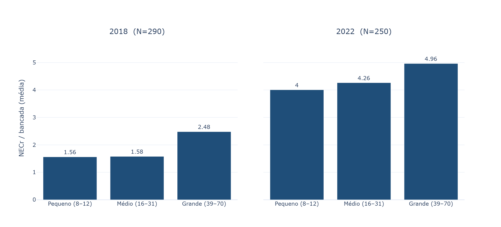
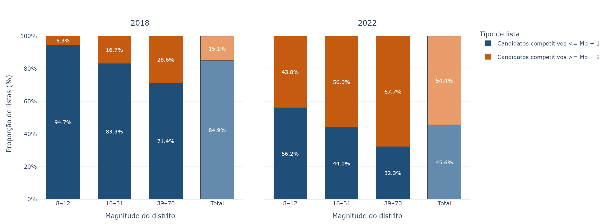
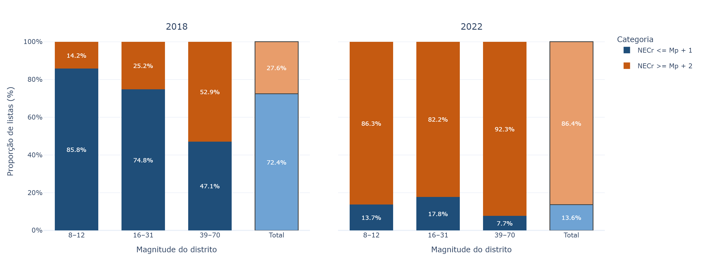
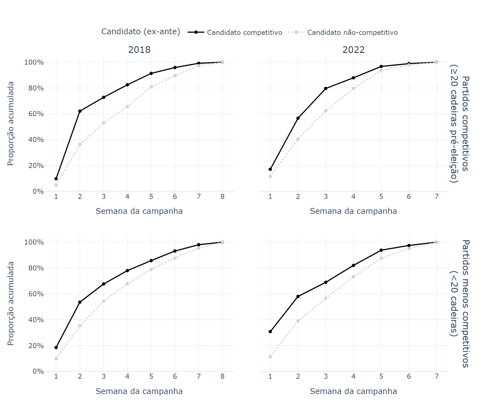
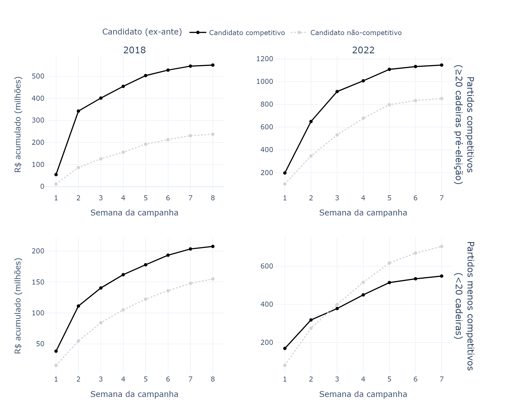
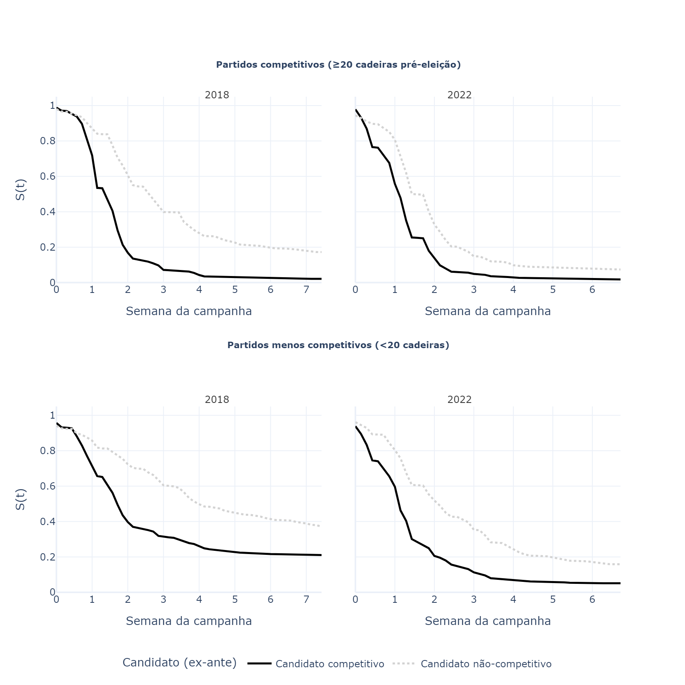
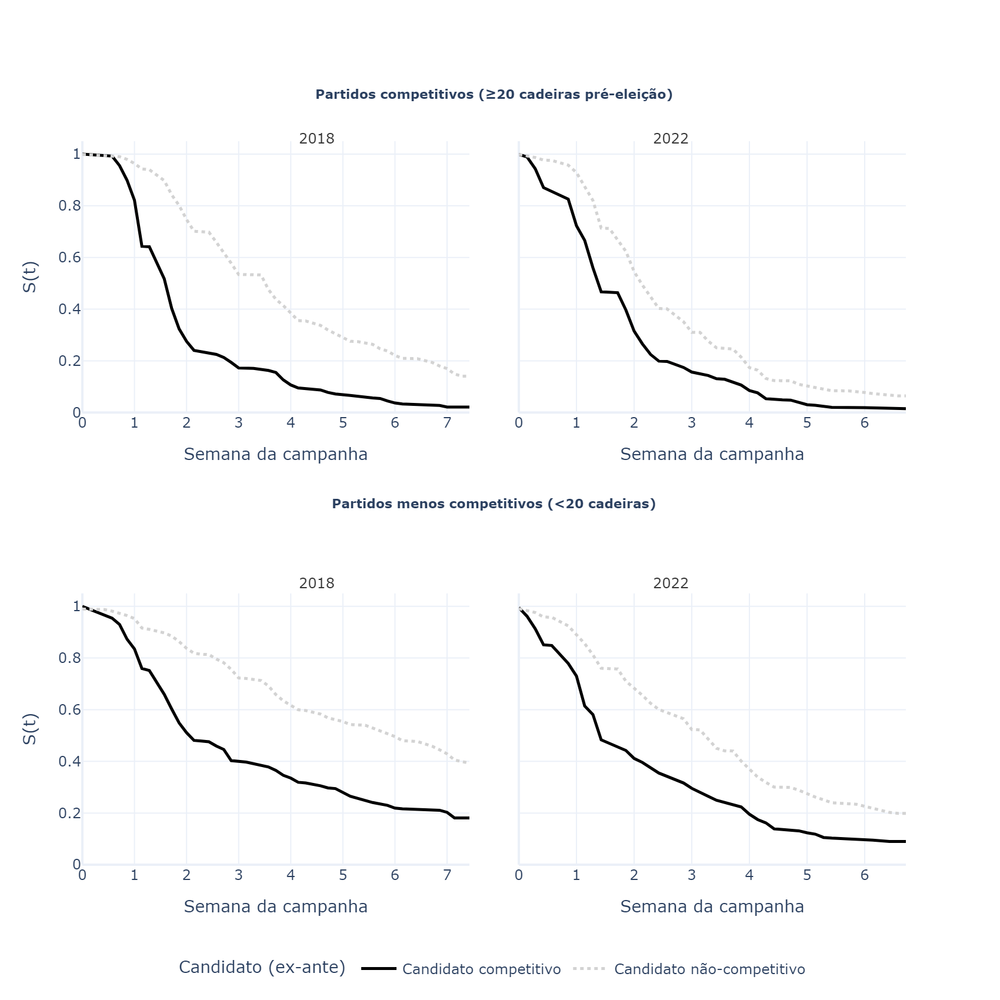
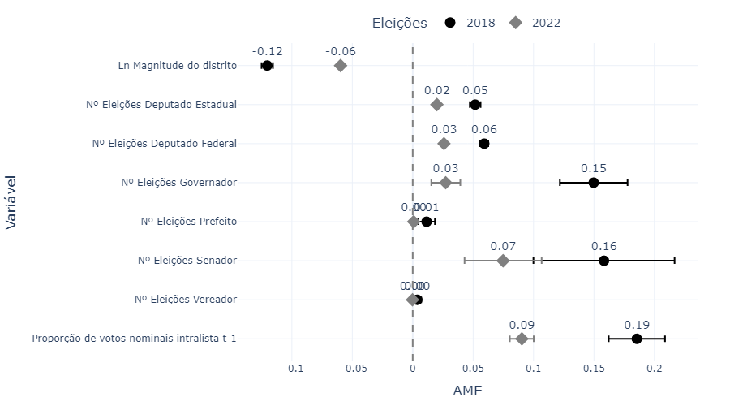

Neste capítulo, mensuro a alocação estratégica de recursos de campanha como *proxy* para coordenação da competição intrapartidária. As decisões sobre a aplicação do financiamento público são dos partidos políticos. Argumento que utilizam este instrumento para sinalizar apoio e definir candidaturas que possuem prioridade. Partidos agem por dois canais distintos: concentram recursos em candidatos competitivos, que recebem recursos maiores e mais cedo.

Dos 6.178 candidatos a Deputado Federal em 2014, 620 (10,0%) foram classificados como "competitivos" pelos critérios adaptados de @cheibubsin2020. Em 2018, foram 7.630 candidaturas com 886 (11,6%) competitivas, e em 2022, 9.675 candidaturas com 1.287 (13,3%) competitivas (@tbl-competitivos-cs). Nota-se uma tendência de crescimento no total de candidaturas competitivas ao longo dos três ciclos, com padrões presentes nos três ciclos eleitorais estudados: a proporção de candidaturas competitivas é sempre menor quando se consideram partidos menos competitivos, independente do tamanho do distrito; e a redução da proporção de competitivos em listas de partidos competitivos ou não conforme a magnitude do distrito cresce. Além disso, também destaca-se o crescimento acentuado na proporção de candidaturas competitivas entre os três ciclos eleitorais, com o percentual para partidos competitivos em distritos pequenos partindo de 18% em 2014 para 31% em 2022.

Outro fator relevante que aparece na @tbl-competitivos-cs é o aumento desproporcional de candidaturas competitivas. Enquanto o total de candidatos lançados saiu de 6.178 para 9.675 entre 2014 e 2022, um aumento de 56%, o total de candidaturas competitivas cresceu 107% no período, saindo de 620 para 1.287 concorrentes.

Estes resultados indicam que partidos políticos estão lançando mais candidaturas com a adoção da cláusula de desempengo e com o fim das doações de campanha de pessoas juríficas (refletido nas eleições de 2018) e com o fim das coligações partidárias em eleições proporcionais somados ao aumento da cláusula de barreira e sua implantação gradual (refletido em 2022). Este lançamento de mais candidaturas, porém, não cresce ao mesmo nível das candidaturas competitivas, indicando que partidos estão buscando construir listas com mais candidaturas de peso. Este novo cenário posiciona as eleições para a Câmara dos Deputados como campo de batalha central para a sobrevivência e atuação dos partidos políticos. Como visto, grande parte dos recursos do FEFC e FP são definidos por critérios que consideram o resultado do partido nas eleições para a câmara baixa. Isto, somado à clausula de desempenho e fim das coligações, torna a construção do quociente partidário responsabilidade do próprio partido somente, salvo os casos em que Federações Partidárias foram firmadas.

| Magnitude      | Partido           | 2014                  | 2018                | 2022                  |
|:---------------|:------------------|:----------------------|:--------------------|:----------------------|
| Pequeno (8–12) | Competitivo       | 120 / 662 (18,1%)     | 164 / 639 (25,7%)   | 255 / 822 (31,0%)     |
| Pequeno (8–12) | Menos competitivo | 48 / 728 (6,6%)       | 99 / 1.071 (9,2%)   | 132 / 1.561 (8,5%)    |
| Médio (16–31)  | Competitivo       | 155 / 779 (19,9%)     | 206 / 821 (25,1%)   | 248 / 1.068 (23,2%)   |
| Médio (16–31)  | Menos competitivo | 48 / 806 (6,0%)       | 89 / 1.298 (6,9%)   | 181 / 2.067 (8,8%)    |
| Grande (39–70) | Competitivo       | 169 / 1.371 (12,3%)   | 217 / 1.275 (17,0%) | 282 / 1.309 (21,5%)   |
| Grande (39–70) | Menos competitivo | 80 / 1.832 (4,4%)     | 111 / 2.526 (4,4%)  | 189 / 2.848 (6,6%)    |
| Total          |                   | 620 / 6.178 (10,0%)   | 886 / 7.630 (11,6%) | 1.287 / 9.675 (13,3%) |
: Candidatos competitivos (critérios ex-ante: incumbência + histórico de 10% QE), por tamanho do distrito e bancada partidária. {#tbl-competitivos-cs}

## Evidências descritivas da alocação intrapartidária

### Concentração de recursos

@cheibubsin2020 encontram que a razão de candidatos competitivos por vaga nas disputas de 2002 a 2014 é 2,1. Com relação ao NECr, repliquei o cálculo e encontrei que os partidos em média lançam 2,9 candidatos efetivos em relação ao dinheiro de campanha por vaga. Assim como os autores, também desagrego este resultado pela magnitude do distrito e o nível de competitividade dos partidos. Distritos com 8 a 12 cadeiras são considerados "pequenos", com 16 a 31 cadeiras são "médios" e com 39 a 70 cadeiras são "grandes". Partidos com 20 ou mais cadeiras nacionais são "competitivos", os demais são "menos competitivos".

A @fig-necr-partido mostra o resultado da média do NECr dividido pela $Mp$, por tipo de partido, magnitude do distrito e ano eleitoral. De maneira geral, partidos competitivos concentram mais recursos que seus concorrentes, com a menor diferença no total dos distritos em 2018, 1,75 candidato efetivo por vaga na $Mp$ para partidos competitivos e 1,87 para menos competitivos.

Há um outro padrão consistente entre todos os ciclos eleitorais: há um salto no número de candidaturas efetivas por cadeira da $Mp$ em listas de partidos menos competitivos em distritos grandes (de 39 a 70 vagas). Ou seja, partidos que possuíam menos de 20 cadeiras no início do período das convenções partidárias não replicam o mesmo grau de concentração na alocação dos recursos existente em distritos pequenos e médios. Estes resultados são consistentes com a proposição de @fivaetal2024, que identificam partidos com maior força eleitoral *ex-ante* como partidos que podem aplicar a estratégia seletiva de concentração de recursos com maior eficácia, considerando as vagas que candidaturas marginais podem conquistar pelas sobras destas listas que somam alto quociente partidário pelo impulsionamento de candidaturas competitivas.

<!-- "Sob a hipótese alternativa de captura individual, não haveria razão para que a concentração variasse com o tamanho do distrito dentro do grupo de partidos fracos — candidatos poderosos capturariam recursos independentemente da magnitude distrital. O padrão observado, pelo contrário, é consistente com limitações organizacionais ao exercício do gatekeeping em contextos de maior competição intrapartidária." -->

{#fig-necr-partido fig-align="center" width="100%"}

Outro indicador é contagem de candidatos competitivos na nominata por $Mp$. Seguindo o M+1 de @cox1997, @cheibubsin2020 encontram que 65% das nominatas possuem até 1 candidato forte a mais do que as vagas vencidas pelo partido. Ao replicar o indicador para os três ciclos, a proporção de listas com até 1 candidato forte a mais do que a bancada ($Mp$) é de 97% em 2014, 94% em 2018 e 56% em 2022 (@fig-fortes). Também calculo este indicador usando o NECr: 90,3% das listas em 2014 possuem até 1 candidato efetivo em recursos a mais do que a bancada do partido, contra 72,4% em 2018 e apenas 13,6% em 2022 (@fig-necr).

{#fig-fortes fig-align="center" width="100%"}

{#fig-necr fig-align="center" width="100%"}

### *Timing* do recebimento do recurso pelas campanhas

Nesta seção, mantenho o foco no *timing* da distribuição de recursos por partidos políticos a suas candidaturas a Deputado Federal em 2014, 2018 e 2022. Estas eleições são substancialmente diferentes do ponto de vista institucional, com alterações no sistema de financiamento e nas próprias regras eleitorais, com a proibição das coligações e a adoção de cláusulas de barreira.

O recebimento antecipado de recursos de campanha dá aos candidatos contemplados maior margem para aplicação deste dinheiro, podendo garantir melhores profissionais, materiais e fornecedores. Além de contribuir para "colocar a campanha na rua" mais cedo e por mais tempo. Dessa forma, argumento que partidos políticos antecipam isso e priorizam a distribuição de recursos para candidaturas competitivas, com estas recebendo recursos sistematicamente antes que seus concorrentes.

As eleições de 2014 são a *baseline*. Na ocasião, a maior parte do dinheiro passou por dois canais: empresas que doaram recursos diretamente para os CNPJs das campanhas dos candidatos escolhidos, e empresas que doaram para o CNPJ do partido político que, em um segundo momento, transferiu o dinheiro para suas candidaturas. Partidos ainda se coligaram para eleições proporcionais e a campanha eleitoral teve 91 dias de duração. Em 2018, doações de pessoas jurídicas já estavam proibidas desde o ciclo eleitoral municipal de 2016, e o FEFC já se tornara o principal provedor de recursos. Partidos também se coligaram para as proporcionais, mas a campanha eleitoral foi reduzida para 52 dias. Já em 2022, com as coligações proibidas, a campanha durou 47 dias.

Mesmo antes do FEFC partidos recebiam recursos para distribuir entre suas candidaturas. Ainda que esta capacidade de agência partidária já existisse, os incentivos postos são diferentes. Com 91 dias de campanha e preponderância de recursos privados, a alocação partidária poderia ser compensatória, transferindo para candidaturas que não conseguiram arrecadar diretamente com as empresas, considerando que candidaturas competitivas teriam acesso direto facilitado a estes financiadores. As doações também poderiam chegar no decorrer das campanhas, com partidos reavaliando estratégias de acordo com maior ou menor arrecadação durante o próprio período eleitoral. Por este motivo, a análise das receitas de campanha de 2014 incluirá todos os recursos de campanha recebidos pelos candidatos, sem distinção de origem.

Sob o FEFC, partidos ganham capacidade de agência ainda maior. Ao saber de antemão o montante reservado para a legenda, lideranças partidárias podem desenhar a estratégia de distribuição dos recursos antes mesmo da campanha começar, adquirindo uma posição de *gatekeeper*, conforme formalizado por @fivaetal2024.

{#fig-semana-campanha fig-align="center" width="100%"}

A @fig-semana-campanha apresenta a proporção acumulada dos recursos recebidos por candidaturas a Deputado Federal no período estudado. Tomando a segunda semana de campanha como exemplo, em 2014 candidaturas competitivas não acumularam recursos registrados na prestação de contas de maneira mais rápida, considerando tanto partidos competitivos ou não. Os partidos menos competitivos, na verdade, tiveram candidaturas não competitivas que angariaram recursos em um passo mais veloz que seus concorrentes competitivos nas primeiras semanas de campanha.

As figura relacionadas a 2018 mostram outro padrão, há um salto relevante na proporção acumulada entre a primeira e segunda semanas do período eleitoral para todos os candidatos e partidos. O salto, porém, é mais acentuado quando se considera apenas candidaturas competitivas, e ainda maior para estes candidatos em partidos competitivos.

Já para 2022, interessa notar que o salto do acúmulo de recursos entre as primeiras semanas permanece elevado para candidatos competitivos em partidos também competitivos, mas a diferença para seus concorrentes é menor que em 2018. Com relação aos candidatos dos partidos menos competitivos, a diferença das proporções da semana um e dois é parecida para os dois tipos de candidatos, mas os competitivos já largam em vantagem de 20p.p.

{#fig-semana-abs fig-align="center" width="100%"}

Alternando para termos absolutos, a @fig-semana-abs mostra que nos partidos competitivos em 2014, todos os candidatos arrecadaram volumes similares durante o primeiro mês de campanha, mas a partir dali a diferença cresce em favor dos competitivos até o fim do período eleitoral. Nos partidos menos competitivos, candidatos que não tiveram boa *performance* em eleições anteriores, acumularam quantias levemente maiores durante todas as semanas da campanha, exceto a primeira.

Em 2018, candidatos competitivos acumularam recursos muito maiores que seus concorrentes, com o nítido salto entre a primeira e segunda semanas de campanha. Neste período, porém, candidatos competitivos de partidos também competitivos tiveram um acréscimo de 250 milhões de reais em suas campanhas, enquanto nos demais partidos, o salto para o mesmo tipo de candidaturas foi menor, de 60 milhões de reais.

Os gráficos relacionados a 2022 na @fig-semana-abs apresentam os resultados mais relevantes em termos teóricos. Enquanto para partidos menos competitivos a vantagem inicial dos candidatos competitivos é revertida logo na terceira semana, o salto dos repasses nas primeiras semanas é da ordem de quase 400 milhões de reais, mais do que o dobro do salto do mesmo tipo de candidatos em partidos menos competitivos.

Como vimos, o "dilema do gatekeeper" formulado por @fivaetal2024 prevê que partidos mais fortes eleitoralmente, aqui considerados competitivos quando possuíam mais de 20 cadeiras na Câmara pré período das convenções, se saem melhor quando o assunto é agir seletivamente. Os resultados apresentados corroboram ao menos ao informar que candidaturas competitivas em partidos competitivos acumulam mais recursos que seus concorrentes, e em uma *velocidade* também maior. 

## O timing dos repasses: Kaplan-Meier

A análise de sobrevivência operacionaliza o "evento" de duas maneiras considerando a diferença em dias entre o início da campanha eleitoral e: i) o primeiro repasse recebido pelo candidato, e ii) o maior repasse recebido ao longo da campanha.

O teste Kaplan-Meier é um método descritivo não-paramétrico usado para calcular a probabilidade de que um indivíduo não tenha experimentado determinado evento até determinada data. Aqui será utilizado para mostrar a probabilidade de que candidaturas competitivas e menos competitivas não tenham recebido o primeiro ou o maior repasse ao longo das semanas de campanha de 2014, 2018 e 2022.

A @fig-km-cs mostra os resultados do teste considerando o primeiro repasse e a @fig-km-maior-cs o maior repasse. Nota-se que a especificação do evento altera substancialmente a curva produzida pelo teste. A alocação antecipada de recursos para candidaturas competitivas é o padrão observado para todas as eleições, porém tal alocação antecipada não ocorre quando se trata do maior repasse para os candidatos de 2014. Candidatos competitivos continuam tendo menores probabilidades de não terem recebido recursos, porém estas probabilidades diminuem quase que linearmente durante as semanas de campanha. 

{#fig-km-cs fig-align="center" width="100%"}

{#fig-km-maior-cs fig-align="center" width="100%"}

## Modelos de Cox: determinantes do recebimento antecipado

As curvas de Kaplan-Meier são evidências preliminares da antecipação da transferência de recursos controlados pelos partidos para candidaturas competitivas, porém os testes não dão conta de controlar por fatores que possam causar a diferença observada, como variáveis institucionais, por exemplo. Os modelos de riscos proporcionais de Cox [-@cox1972] permitem estimar o efeito de múltiplas variáveis como determinantes estruturais sobre a "taxa instantânea" da alocação dos recursos de campanha. É uma especificação semi-paramétrica, que estima a probabilidade condicional de um candidato receber a transferência do partido em um dado instante. Nestes modelos, calcula-se a *hazard ratio* (HR) que indica o quanto a "taxa instantânea" da ocorrência da alocação aumenta ou diminui para cada unidade adicional da variável. O HR superior a um indica recebimento antecipado.

Aplicando os testes para os três ciclos eleitorais em separado, nota-se que para cada eleição anteriormente vencida para deputado federal, candidatos tem aumento de 63, 54 e 37% de aumento na "taxa instantânea" de recebimento em 2014, 2018 e 2022 respectivamente. O maior efeito está na proporção de votos nominais dentro do distrito disputado na eleição anterior, indicando que além do histórico eleitoral de vitórias, o desempenho eleitoral imediatamente anterior para recandidaturas a Câmara dos Deputados é um determinante para recebimento antecipado de recursos partidários na campanha eleitoral. Um resultado surpreendente é que não há efeito da magnitude do distrito sobre o tempo das transferências de recursos entre partidos a seus candidatos.

```{python}
#| label: tbl-cox
#| tbl-cap: "Determinantes do *timing* do repasse partidário — Modelo Cox PH. HR: *hazard ratio*; IC 95\\%: intervalo de confiança de 95\\%. SE clusterizados por partido × UF. \\*p<0,05; \\*\\*p<0,01; \\*\\*\\*p<0,001. †2014 = pré-FEFC (apenas Fundo Partidário)."
import pandas as pd
from tabulate import tabulate
from IPython.display import Markdown

rotulos = {
    "n_eleicoes_deputado_federal":  "N. Eleições Dep. Federal",
    "n_eleicoes_deputado_estadual": "N. Eleições Dep. Estadual",
    "n_eleicoes_vereador":          "N. Eleições Vereador",
    "n_eleicoes_prefeito":          "N. Eleições Prefeito",
    "n_eleicoes_governador":        "N. Eleições Governador",
    "n_eleicoes_senador":           "N. Eleições Senador",
    "prop_votos_nominais_lag":      "Prop. votos nominais (t-1)",
    "log_qt_vaga":                  "Ln(magnitude)",
    "mulher":                       "Mulher",
    "negra":                        "Negra/Parda",
}

def sig(p):
    if p < 0.001: return "***"
    if p < 0.01:  return "**"
    if p < 0.05:  return "*"
    return ""

df = pd.read_parquet("../data/processed/df_cox_survival.parquet")
df["label"] = df["variavel"].map(rotulos)

def formatar_ano(df, ano):
    d = df[df["ano"] == ano].copy()
    d["HR"] = d["exp(coef)"].map("{:.3f}".format) + d["p"].apply(sig)
    d["IC 95%"] = (
        "["
        + d["exp(coef) lower 95%"].map("{:.3f}".format)
        + "; "
        + d["exp(coef) upper 95%"].map("{:.3f}".format)
        + "]"
    )
    return d.set_index("label")[["HR", "IC 95%"]]

t14 = formatar_ano(df, 2014).rename(columns={"HR": "HR 2014†", "IC 95%": "IC 95% 2014"})
t18 = formatar_ano(df, 2018).rename(columns={"HR": "HR 2018",  "IC 95%": "IC 95% 2018"})
t22 = formatar_ano(df, 2022).rename(columns={"HR": "HR 2022",  "IC 95%": "IC 95% 2022"})

tbl = t14.join(t18).join(t22).reset_index().rename(columns={"label": "Covariável"})

Markdown(tabulate(tbl, headers="keys", tablefmt="pipe", showindex=False))
```

## A intensidade da seleção: modelos fracionários para proporção de recursos

Para avaliar como o sucesso eleitoral anterior afeta a proporção de recursos que cada candidatura recebe dentro das listas partidárias, o modelo proposto segue a formulação de @papke1996, apropriada para variáveis dependentes fracionárias no intervalo [0,1]. Essa abordagem permite estimar diretamente os efeitos marginais médios (AMEs). A estimação foi feita por GLM (família Binomial, link Logit), com erros-padrão clusterizados por lista e ano eleitoral, e os resultados são reportados como efeitos marginais médios (AMEs), expressos em pontos percentuais de variação na proporção de recursos esperada. Devido a alterações institucionais entre as eleições de 2018 e 2022, como o aumento da cláusula de barreira e um montante maior de recursos do FEFC, calculei as regressões para cada eleição separadamente.

A variável dependente é a proporção dos recursos de campanha recebidos por cada candidato em relação ao total distribuído pelo partido em sua lista estadual. Essa operacionalização permite analisar de que forma o histórico eleitoral influencia a "fatia do bolo partidário" captada por cada candidato. Para isso, utilizo dados das eleições desde 2002, identificando o histórico eleitoral de todos os candidatos que disputaram as eleições de 2018 e 2022. Foram construídas variáveis de contagem representando o número de eleições vencidas por cargo específico.

A @fig-reg-frac apresenta os resultados das regressões. Todos os coeficientes das variáveis de contagem de eleições vencidas por cargo são positivos e estatisticamente significativos. Os coeficientes são pontos percentuais que indicam, na média, qual o efeito marginal de se ter vencido uma eleição adicional para cada cargo. Os maiores efeitos estão associados às vitórias para os cargos de Governador e Senador, que são as variáveis com maior erro padrão, devido à menor frequência de candidatos com esse histórico. Para as vitórias nas disputas para Deputado Federal e Estadual, os efeitos são menores, mas ainda assim positivos e significativos. Nestes casos, as candidaturas recebem em média 6 e 5 p.p. a mais, respectivamente, na alocação intrapartidária para cada eleição vencida em 2018, caindo para 3 e 2 p.p. em 2022. Os controles adicionados também estão na direção esperada, com distritos com maior magnitude associados a um ambiente mais competitivo entre as candidaturas em termos de recursos de campanha. Ainda, a proporção de votos recebidos pelos candidatos na eleição anterior está associada a um aumento na proporção de recursos recebidos, reforçando a ideia de que o desempenho eleitoral prévio é um indicativo relevante para a alocação partidária.

{#fig-reg-frac fig-align="center" width="100%"}

## Discussão dos resultados

<!-- RASCUNHO NECESSÁRIO — esta seção precisa ser escrita integralmente:
- Sintetizar como os três conjuntos de evidências convergem: (a) descritivas → padrão visual de antecipação e concentração compatível com H1, H2, H3; (b) KM → candidatos competitivos recebem o primeiro e o maior repasse antes; (c) Cox → o efeito persiste controlando por variáveis institucionais; (d) fracionária → candidatos competitivos recebem fatia maior da lista
- Destacar o contraste central: em 2014 a alocação é progressiva e tem componente reativo (dinheiro chega ao longo da campanha conforme arrecadação privada); em 2018 e 2022 com o FEFC a alocação é antecipada e concentrada desde o início — mudança qualitativa na lógica de coordenação
- Discutir a atenuação entre ciclos: HR para Dep. Federal cai de 63% (2014) → 54% (2018) → 37% (2022); AMEs também declinam entre 2018 e 2022 — possíveis explicações: (i) adaptação dos partidos às novas regras; (ii) maior fragmentação da nominata com fim das coligações; (iii) competição por recursos entre mais candidatos sem a "manta" da coligação
- Conectar ao argumento da tese: os recursos do FEFC funcionam como instrumento ex-ante de coordenação — partidos usam dinheiro para sinalizar prioridade antes que o eleitor defina o resultado
- Reconhecer limitações: análise correlacional, não causal; sem contrafactual claro para o papel do partido vs. candidato; heterogeneidade entre partidos está parcialmente captada pelos modelos (efeitos fixos de partido), mas não completamente
-->
