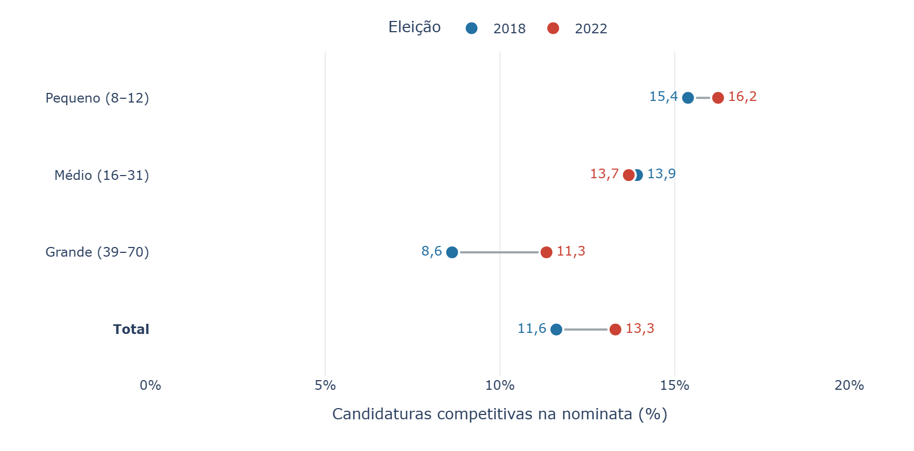

<!-- Revisão de 11/09/2026. Incorpora resultados-financiamento-alternativo/, resultados-teto-financiamento/ e exploracao-gastos-teto/, além dos resultados-capitulo-3/. Os modelos fracionários legados são preservados sem reestimação; suas pendências de documentação permanecem explicitadas. O apêndice integra este arquivo. Top-Mp não foi calculado. -->

Partidos podem coordenar a competição intrapartidária por meio da distribuição seletiva de recursos de campanha. Ao financiar desigualmente as candidaturas apresentadas, estabelecem um núcleo de priorização financeira dentro da nominata. Nesta tese, argumento que a amplitude desse núcleo, sua composição e o momento dos repasses permitem investigar uma dimensão observável da organização partidária da competição. Essa dimensão não se confunde com o conjunto completo de candidatos que as lideranças consideram eleitoralmente relevantes.

Este capítulo investiga a priorização financeira nas eleições para deputado federal de 2018 e 2022. O argumento empírico se organiza em três dimensões: amplitude, concentração e focalização. A primeira identifica o tamanho das listas e do conjunto efetivo financiado; a segunda situa esse conjunto em relação à nominata; e a terceira examina sua composição e sua correspondência com os eleitos. Após estabelecer essa correspondência, o capítulo investiga os vencedores que ficaram fora do núcleo, perguntando se dispõem de maior financiamento por outras fontes. O propósito é delimitar o alcance do indicador, sem transformá-lo em uma medida geral de competitividade eleitoral.

A distinção temporal organiza essa análise. A bancada de referência e o histórico eleitoral antecedem a disputa; os repasses registram alocações que podem responder à evolução da campanha; e os resultados eleitorais permitem avaliar retrospectivamente a correspondência entre financiamento e representação. Os indicadores financeiros utilizam receitas acumuladas na prestação de contas, inclusive registros posteriores à votação, e não uma fotografia do financiamento em uma data anterior ao pleito. Sua construção independe dos votos e da condição de eleito, mas essa independência não os torna medidas estritamente *ex ante*. É preciso distinguir a ausência de informação eleitoral na fórmula da precedência temporal de todos os valores que a compõem.

Essa distinção também orienta o diálogo com a literatura. @crisp2007 discutem o uso da magnitude distrital ($M$) por @careyshugart1995 como referência para os incentivos ao voto pessoal. A disputa entre candidatos de todos os partidos pelas cadeiras do distrito difere da competição entre correligionários pelas cadeiras que seu partido pode conquistar. A razão entre candidaturas e cadeiras esperadas, $C:P$, dirige a atenção a essa segunda dimensão e à unidade partido-no-distrito.

A operacionalização de seus componentes, contudo, exige escolhas. @cheibubsin2020 restringem o universo de concorrentes às candidaturas competitivas e utilizam as cadeiras conquistadas pelo partido como referência para sua capacidade eleitoral. O problema, para o argumento desta tese, aparece quando o resultado da própria eleição representa a expectativa anterior das lideranças: há um desalinhamento temporal entre o conceito e sua medida. Utilizar resultados eleitorais para estudar coordenação não é, por si só, circular; é necessário distinguir seu uso como referência da decisão anterior de seu uso como resultado com o qual essa decisão será confrontada.

Os resultados apontam para a ampliação do conjunto efetivo financiado entre 2018 e 2022, acompanhada da presença de candidaturas com credenciais anteriores e de eleitos muito acima da esperada em uma seleção aleatória de igual tamanho dentro das listas. Os vencedores fora desse núcleo apresentam maior arrecadação alternativa que os não eleitos também situados fora. Os testes adicionais, contudo, não encontram evidência sistemática de redução do financiamento partidário em resposta à capacidade privada. A combinação desses achados permite discutir coordenação como priorização financeira seletiva, sem equipará-la à identificação de todos os candidatos capazes de vencer nem atribuir às lideranças uma estratégia de complementação não demonstrada pelos dados.

## Prioridade eleitoral, repasses e recursos de campanha

Prioridade eleitoral, transferência partidária e disponibilidade total de recursos são conceitos distintos. A primeira se refere à importância que a candidatura tem para os objetivos das lideranças, que não é diretamente observada. A segunda registra quanto dinheiro de origem partidária chega à candidatura. A terceira inclui também recursos próprios, doações de pessoas físicas e outras receitas. Candidatos com posições semelhantes nos planos do partido podem mobilizar montantes diferentes fora dele e, assim, receber volumes diferentes de transferências.

Uma possibilidade é que o partido procure completar um orçamento considerado suficiente ou desejável para a candidatura, $B_i^*$:

$$
F_i^{partido}\approx\max\{0,\;B_i^*-A_i\},
$$

em que $A_i$ representa os recursos alternativos que o partido conhece ou espera que estejam disponíveis. A expressão descreve uma hipótese de comportamento, não uma identidade contábil ou uma função estimada neste capítulo. O orçamento desejado é latente, pode variar entre candidatos e não precisa coincidir com o teto legal de gastos. Além disso, as receitas finais registradas não revelam quanto as lideranças conheciam em cada momento da campanha.

Essa possibilidade impede interpretar o ranking de transferências como uma escala completa da prioridade eleitoral: receber o dobro dos recursos não significa ser duas vezes mais prioritário. O Top-NECr identifica diretamente o núcleo dos maiores recebedores de recursos partidários, cujo tamanho deriva da distribuição desses recursos. É nesse sentido restrito que o capítulo utiliza a expressão *priorização financeira*. A origem partidária do repasse também não demonstra, isoladamente, comando unilateral das lideranças: a alocação pode incorporar demandas, negociações e capacidade individual de obter recursos.

## Dados, unidades de análise e operacionalização

### Universo empírico e recursos partidários

A análise utiliza registros de candidaturas, resultados eleitorais e prestação de contas provenientes do TSE, além da composição da Câmara dos Deputados obtida por sua API. O universo reúne 7.630 candidaturas em 2018 e 9.675 em 2022. A candidatura é a unidade utilizada para identificar o histórico eleitoral e estimar a participação nos recursos. Para examinar a distribuição intrapartidária, essas observações são agregadas por partido, unidade da federação e eleição, formando as nominatas.

| Universo                                                 |  2018 |  2022 |
|:---------------------------------------------------------|------:|------:|
| Candidaturas                                             | 7.630 | 9.675 |
| Nominatas                                                |   859 |   711 |
| Nominatas com recursos partidários positivos             |   786 |   648 |
| Nominatas com bancada de referência positiva             |   292 |   252 |
| Nominatas com recursos e bancada de referência positivos |   290 |   250 |
| Nominatas com eleitos                                    |   302 |   207 |
| Eleitos                                                  |   513 |   513 |

: Universos de análise por eleição. Fonte: elaboração própria com base nas bases consolidadas do capítulo. {#tbl-universos}

Os recursos considerados correspondem à variável de receitas com origem em “Recursos de partido político”. Essa seleção identifica a origem partidária do repasse e não restringe, por si só, a fonte aos fundos públicos FEFC e FP. Embora a tese discuta a alocação de recursos no contexto do financiamento público, os indicadores deste capítulo devem ser interpretados como medidas de distribuição de recursos de origem partidária.

Na investigação dos candidatos fora do núcleo, distinguem-se duas definições de financiamento alternativo. A definição ampla reúne todas as receitas cuja origem não é “Recursos de partido político”; inclui, portanto, transferências de outros candidatos e outras origens que não devem ser chamadas indistintamente de privadas. A definição estrita soma recursos próprios e doações de pessoas físicas. São classificações pela origem registrada, sem rastreamento da fonte última de cada transferência. Nenhuma dessas receitas é acrescentada ao NECr ou ao ranking que define o Top-NECr.

<!-- Conferência de origem: resultados-capitulo-3/19_notas_redacao.csv. Uma análise exclusiva de FEFC/FP exigiria outra seleção e recálculo. -->

O tamanho da nominata inclui todas as suas candidaturas, inclusive aquelas sem recursos partidários. Os indicadores de concentração exigem que a nominata tenha recursos positivos. As comparações com a bancada exigem também bancada positiva. Já a cobertura nacional dos eleitos mantém os 513 representantes de cada eleição no denominador, incluindo os três eleitos de 2018 pertencentes a listas sem recursos partidários.

A unidade partidária é mantida nas duas eleições. Em 2022, partidos integrantes de uma mesma federação aparecem separadamente. Assim, a comparação descreve a alocação dentro dos partidos, mas não resolve integralmente a comparabilidade das unidades de competição eleitoral entre os pleitos. Uma análise por federação exigiria reagrupar candidaturas e recalcular o número efetivo e os rankings financeiros.

### Referências anteriores à campanha

A expectativa de cadeiras das lideranças não é diretamente observável. @crisp2007 operacionalizam a magnitude partidária a partir do desempenho em eleições anteriores. No contexto brasileiro, migrações e reorganizações partidárias tornam pertinente uma referência que incorpore a composição mais recente das bancadas. A tese utiliza $Mp$ para designar o número de deputados em exercício vinculados a cada partido e UF na referência anterior à eleição.

Essa bancada oferece uma referência observável de representação, mas não equivale à expectativa subjetiva das lideranças. Pode não captar perspectivas de crescimento, retração ou mudanças no ambiente competitivo. Por esse motivo, a correspondência entre financiamento e $Mp$ é tratada como uma comparação empírica, e não como critério suficiente para classificar uma nominata como coordenada.

Os resultados utilizam a bancada disponível no arquivo consolidado. O script de extração registra as datas de 20 de julho de 2018 e 20 de julho de 2022, mas o CSV não preserva a data de referência. Essa limitação impede certificar, apenas pelo arquivo empregado, que a contagem corresponda à véspera das convenções partidárias.[^03-medindo-coordenacao-intrapartidaria-reestruturado-1]

[^03-medindo-coordenacao-intrapartidaria-reestruturado-1]: A definição temporal pretendida deve ser conciliada com a extração antes da versão definitiva. As estatísticas aqui apresentadas preservam a bancada utilizada no relatório de resultados.

O histórico eleitoral permite identificar candidaturas com credenciais anteriores à disputa. Inspirada em @cheibubsin2020, a classificação utilizada considera competitiva a candidatura com vitória anterior para governador, senador, deputado federal, estadual ou distrital, ou prefeito, ou que tenha alcançado historicamente pelo menos 10% do quociente eleitoral. O desempenho na eleição corrente não participa dessa classificação.

O vínculo entre registros históricos utiliza o CPF. A construção da base remonta a 1998 e inclui vitórias nas eleições municipais anteriores: até 2016 para os candidatos de 2018 e até 2020 para os de 2022. A implementação não incorpora uma variável de vitórias presidenciais. A medida identifica credenciais registradas no histórico disponível; candidaturas sem essas credenciais podem, ainda assim, ser competitivas na eleição em análise.

### Amplitude e concentração do financiamento

O número de candidaturas da nominata, $C_{puy}$, define seu tamanho formal, para o partido $p$, na UF $u$ e eleição $y$. Para descrever a distribuição financeira, utiliza-se o número efetivo de candidaturas em recursos, adaptando a medida de @laaksotaagepera1979 e seguindo @thomsen2023:

$$
NECr_{puy}=\frac{1}{\sum_{i=1}^{C_{puy}}s_i^2},
\qquad
s_i=\frac{R_i}{\sum_j R_j}.
$$

$R_i$ representa os recursos de origem partidária recebidos pela candidatura. O indicador expressa a quantas candidaturas igualmente financiadas equivale a distribuição observada. Se uma candidatura recebe todos os recursos, $NECr=1$; se todas recebem parcelas iguais, $NECr=C$. Trata-se do número efetivo de candidaturas entre as quais se distribuem os recursos partidários, não de uma contagem literal de recebedores ou do número de candidatos que as lideranças consideram competitivos.

O NECr descreve a amplitude efetiva do financiamento, mas sua interpretação como concentração depende também do tamanho da lista. Por isso, os resultados apresentam sua relação com $C$. A razão $C/NECr$ indica quantas candidaturas formais existem por candidatura efetiva em recursos; valores mais elevados representam maior concentração relativa. A razão inversa, $NECr/C$, aproxima-se de um quando a distribuição é uniforme. Essas razões são calculadas em cada nominata: a média de uma não é o inverso da média da outra.

### Focalização no núcleo de financiamento partidário

Para identificar pessoas dentro desse núcleo, as candidaturas são ordenadas pelos recursos partidários recebidos. O Top-NECr corresponde às primeiras $k$ posições, com $k=\lfloor NECr+0{,}5\rfloor$. Essa regra converte a medida contínua em um corte no ranking. Em caso de empate no limite, atribui-se crédito fracionário às candidaturas empatadas, preservando o total de posições. Nas listas sem recursos, o núcleo é definido como vazio. Estar fora significa não integrar, ou integrar apenas parcialmente em caso de empate, esse recorte do ranking; não significa necessariamente deixar de receber apoio partidário.

A focalização é examinada em relação a dois grupos: candidatos previamente competitivos e eleitos. A cobertura informa a parcela de cada grupo contida no núcleo. A precisão informa a parcela das posições do núcleo ocupada por integrantes desse grupo. Para os eleitos, a cobertura nacional divide os eleitos no Top-NECr pelos 513 eleitos; a precisão divide os eleitos no núcleo pela soma das posições Top-NECr de todas as nominatas.

Um núcleo maior pode elevar mecanicamente a cobertura. O parâmetro de comparação é, portanto, uma seleção aleatória de $k$ candidatos dentro de cada nominata, preservando seu tamanho e seu número de eleitos ou competitivos. Denotando por $A_l$ o total do grupo de interesse na lista $l$ e por $H_l$ o número de integrantes desse grupo no núcleo, temos:

$$
\text{Cobertura observada}=\frac{\sum_l H_l}{\sum_l A_l},
\qquad
\text{Cobertura esperada}=\frac{\sum_l A_l k_l/C_l}{\sum_l A_l}.
$$

A razão entre acertos observados e esperados, denominada *lift*, indica quanto a presença do grupo no núcleo supera o sorteio: $\sum_l H_l/\sum_l(A_l k_l/C_l)$. Os cálculos são realizados separadamente para cada eleição. Não se utiliza uma referência fixa comum aos pleitos nem a média simples dos lifts das nominatas. Listas sem integrantes do grupo não têm cobertura individual definida, mas podem contribuir para o denominador da precisão quando possuem posições no núcleo.

Essas medidas distinguem os papéis das informações utilizadas. A presença de competitivos prévios avalia a associação entre credenciais anteriores e financiamento acumulado. A presença de eleitos avalia a correspondência retrospectiva entre esse financiamento e o resultado, sem transformar a eleição em medida da expectativa das lideranças. O parâmetro aleatório sorteia pessoas para um núcleo de mesmo tamanho; não simula a redistribuição de dinheiro nem seus possíveis efeitos sobre os votos.

<!-- Extensão discutida: cobertura Top-Mp. Não incorporada à análise porque o atlas não oferece seus resultados. Se calculada, definir k=min(Mp,C), explicitar Mp=0 e o limite de cobertura quando E>Mp, além de manter o tratamento de empates. -->

## Resultados

### Amplitude: composição das nominatas e tamanho efetivo financiado

#### Candidaturas e competitividade prévia

A composição das listas estabelece o universo sobre o qual ocorre a distribuição dos recursos. Entre 2018 e 2022, o número de candidaturas passou de 7.630 para 9.675, crescimento de 26,80%. O número de candidatos previamente competitivos aumentou de 886 para 1.287, ou 45,26%. Sua participação nacional passou de 11,61% para 13,30%. Assim, o crescimento das nominatas foi acompanhado de uma expansão proporcionalmente maior das candidaturas com credenciais eleitorais anteriores.

Essa mudança agregada não se reproduz de maneira uniforme entre magnitudes distritais. Nos distritos médios, a participação dos competitivos recuou ligeiramente, de 13,92% para 13,68%. A @fig-competitivos-mag apresenta a composição por magnitude. Os percentuais agregam candidatos de cada grupo; não representam a média das proporções das listas.

{#fig-competitivos-mag fig-align="center" width="100%"}

A comparação com a bancada pré-eleitoral acrescenta uma referência à amplitude dessa competição. Entre as listas com $Mp>0$, 248 de 292 nominatas em 2018, ou 84,93%, tinham até um candidato competitivo a mais que sua bancada. Em 2022, eram 115 de 252, ou 45,63%. A comparação dialoga com a discussão de @cox1997 e @cheibubsin2020, mas utiliza a bancada anterior como referência, em lugar das cadeiras conquistadas na própria eleição. Não se trata, portanto, de uma replicação com medidas idênticas.

Esses resultados indicam uma ampliação do conjunto de candidatos com credenciais anteriores em relação à representação partidária disponível. Ainda não permitem estabelecer se esses candidatos foram priorizados financeiramente. Essa questão exige observar a distribuição dos recursos e a composição do núcleo financiado.

#### Expansão do conjunto efetivo financiado

Nas nominatas com recursos partidários positivos, o tamanho mediano da lista aumentou de quatro para nove candidaturas. No mesmo universo, a mediana do NECr passou de 1,88 para 4,81, enquanto sua média aumentou de 2,96 para 5,90 (@tbl-amplitude). O financiamento passou, portanto, a equivaler à sustentação de um número maior de candidaturas com parcelas iguais.

| Indicador                          | 2018 |  2022 |
|:-----------------------------------|-----:|------:|
| Nominatas com recursos positivos   |  786 |   648 |
| Candidaturas por nominata: média   | 9,41 | 14,42 |
| Candidaturas por nominata: mediana | 4,00 |  9,00 |
| NECr: média                        | 2,96 |  5,90 |
| NECr: mediana                      | 1,88 |  4,81 |
| NECr: desvio-padrão                | 3,17 |  4,87 |

: Amplitude formal e efetiva nas nominatas financiadas. Cada nominata recebe o mesmo peso nas estatísticas. Fonte: elaboração própria com base nos dados consolidados do TSE. {#tbl-amplitude}

A diferença entre médias e medianas mostra que as distribuições incluem listas com valores mais elevados. O desvio-padrão do NECr também aumenta, de 3,17 para 4,87: a expansão média convive com maior dispersão absoluta entre nominatas. O resultado não implica que todos os partidos tenham ampliado seu conjunto financiado na mesma proporção.

A expansão aparece igualmente quando o número efetivo é situado diante da referência pré-eleitoral de cadeiras. Entre nominatas com recursos positivos e $Mp>0$, a média de NECr por cadeira da bancada aumentou em todas as magnitudes (@fig-necr-magnitude). Nos distritos pequenos, passou de 1,56 para 4,00; nos médios, de 1,58 para 4,26; e nos grandes, de 2,48 para 4,96. Esses cálculos abrangem 290 listas em 2018 e 250 em 2022.

{#fig-necr-magnitude fig-align="center" width="100%"}

O afastamento em relação a $Mp$ limita uma interpretação de coordenação baseada na coincidência estrita entre o núcleo financiado e a bancada anterior. Pode refletir tanto a ampliação da prioridade financeira quanto a insuficiência da bancada como representação das perspectivas eleitorais. Para avaliar a seletividade dessa expansão, é necessário situá-la em relação ao tamanho formal das listas e identificar quais candidaturas compõem o núcleo.

### Concentração: diferenciação financeira dentro das nominatas

O crescimento do NECr não equivale, isoladamente, a uma redução da concentração: listas maiores podem sustentar conjuntos efetivos maiores mantendo distribuição semelhante. A @tbl-concentracao compara o número formal de candidatos ao número efetivo em recursos nas nominatas financiadas.

| Medida de concentração relativa |  2018 |  2022 |
|:--------------------------------|------:|------:|
| C/NECr: média                   |  3,29 |  2,67 |
| C/NECr: mediana                 |  1,95 |  1,86 |
| NECr/C: média (%)               | 56,18 | 55,40 |

: Concentração relativa dos recursos nas nominatas financiadas. As razões são calculadas por lista antes da agregação. Fonte: elaboração própria com base no atlas e nas bases consolidadas do capítulo. {#tbl-concentracao}

A média de candidaturas formais por candidatura efetiva diminuiu de 3,29 para 2,67. A mediana variou menos, de 1,95 para 1,86, permanecendo próxima de duas candidaturas formais para cada candidatura efetiva em recursos. Nessa medida, a concentração relativa diminui, sobretudo quando observada pela média.

A média da razão inversa, entretanto, permaneceu próxima de 55% a 56%. Não há contradição aritmética: inverter a razão altera o peso dos diferentes pontos da distribuição, e a média de inversos não corresponde ao inverso da média. Em conjunto, os indicadores sustentam com mais clareza a ampliação absoluta do financiamento do que uma redução uniforme da concentração relativa. Tampouco esses percentuais indicam a parcela de candidatos que recebeu algum recurso.

A distribuição permaneceu desigual: o tamanho efetivo financiado continuou inferior ao tamanho formal das nominatas em termos agregados. Mas a desigualdade financeira, por si só, não revela o critério de seleção. Um partido pode concentrar recursos em candidaturas sem credenciais anteriores ou dispersá-los entre vários candidatos eleitoralmente relevantes. A dimensão seguinte examina essa composição.

### Focalização: credenciais anteriores e correspondência com os eleitos

#### Competitivos prévios entre os mais financiados

Os núcleos definidos pelo Top-NECr incorporaram 80,90% dos candidatos previamente competitivos em 2018 e 82,68% em 2022 (@tbl-focalizacao-previa). Se o mesmo número de posições fosse preenchido por sorteio dentro de cada nominata, as coberturas esperadas seriam 43,19% e 43,75%, respectivamente.

| Medida                          |  2018 |  2022 |
|:--------------------------------|------:|------:|
| Competitivos prévios            |   886 | 1.287 |
| Cobertura observada (%)         | 80,90 | 82,68 |
| Cobertura esperada ao acaso (%) | 43,19 | 43,75 |
| Excedente sobre o acaso (p.p.)  | 37,71 | 38,93 |
| Lift                            |  1,87 |  1,89 |

: Presença de candidaturas previamente competitivas no Top-NECr. Razões nacionais de somas, com crédito fracionário nos empates. Fonte: elaboração própria com base nos resultados de focalização do atlas. {#tbl-focalizacao-previa}

Os lifts de 1,87 e 1,89 indicam uma presença de competitivos prévios no núcleo superior à esperada pelo seu tamanho e pela composição das listas. A pequena variação entre eleições sugere persistência dessa associação durante a ampliação do conjunto financiado. Os resultados são compatíveis com uma distribuição que prioriza credenciais eleitorais anteriores, embora não revelem diretamente os critérios deliberados pelas lideranças.

#### Histórico eleitoral e participação nos recursos partidários

A análise do Top-NECr identifica a presença de candidatos com credenciais anteriores no núcleo. Os modelos fracionários aprofundam essa questão ao examinar a parcela dos recursos recebida por cada candidatura. Seguindo @papke1996, a variável dependente é a participação individual no total de recursos partidários da nominata, definida no intervalo $[0,1]$.

A estimação utiliza GLM com família binomial e ligação logit, com erros-padrão agrupados por nominata. Os modelos são estimados separadamente para 2018 e 2022, e os resultados são apresentados como efeitos marginais médios, em pontos percentuais. As variáveis de interesse contabilizam vitórias anteriores por cargo; a especificação também inclui a proporção de votos na eleição anterior e controles de contexto eleitoral.

<!-- Conferência pendente herdada do capítulo original: a seção dos modelos informa histórico desde 2002, enquanto a base de competitividade remonta a 1998. Não se presume aqui que as janelas sejam idênticas. Conferir a amostra, a janela e a especificação no script antes de finalizar a descrição de replicação. Os resultados abaixo e a figura são os já reportados, sem reestimação. -->

A @fig-reg-frac apresenta as estimativas já reportadas no capítulo. As vitórias anteriores estão positivamente associadas à participação esperada nos recursos. Para deputado federal e estadual, uma vitória adicional corresponde, aproximadamente, a diferenças de seis e cinco pontos percentuais em 2018, e de três e dois pontos percentuais em 2022, respectivamente. As estimativas para governador e senador são maiores e apresentam maior incerteza.

{#fig-reg-frac fig-align="center" width="100%"}

A proporção de votos obtida anteriormente também apresenta associação positiva com o financiamento, segundo os resultados reportados. Essas evidências convergem com a presença de competitivos no Top-NECr: credenciais anteriores estão relacionadas tanto à inclusão no conjunto priorizado quanto à parcela de recursos recebida. Os efeitos marginais descrevem associações condicionais; não identificam o efeito causal de uma vitória anterior. Sua comparação entre eleições também deve considerar que a parcela individual é medida em nominatas de tamanhos diferentes.

#### Eleitos no núcleo de financiamento partidário

A correspondência com os resultados eleitorais acrescenta uma avaliação posterior da prioridade financeira. O Top-NECr incluiu 86,74% dos eleitos em 2018 e 92,63% em 2022. O benchmark foi recalculado em cada eleição, preservando o tamanho do núcleo e a composição de cada lista: as coberturas esperadas foram 43,78% e 43,75% (@tbl-cobertura-eleitos). A proximidade entre esses valores é um resultado do cálculo, e não a imposição de uma referência única.

| Medida                          |  2018 |  2022 |
|:--------------------------------|------:|------:|
| Eleitos                         |   513 |   513 |
| Posições Top-NECr               | 2.318 | 3.824 |
| Cobertura observada (%)         | 86,74 | 92,63 |
| Cobertura esperada ao acaso (%) | 43,78 | 43,75 |
| Excedente sobre o acaso (p.p.)  | 42,97 | 48,88 |
| Lift                            |  1,98 |  2,12 |
| Precisão (%)                    | 19,20 | 12,43 |

: Cobertura e precisão dos eleitos no Top-NECr. As posições incluem todas as nominatas financiadas; a cobertura mantém todos os eleitos no denominador. Fonte: elaboração própria com base nos resultados de focalização do atlas. {#tbl-cobertura-eleitos}

A cobertura aumenta mesmo quando confrontada com o benchmark que incorpora o tamanho de cada núcleo. O lift passa de 1,98 para 2,12: a quantidade de eleitos no Top-NECr equivale a aproximadamente duas vezes a esperada por sorteio dentro das listas. Isso mostra que a correspondência observada não se resume à inclusão de mais posições no ranking.

A precisão, porém, diminui de 19,20% para 12,43%. O conjunto ampliado incorpora uma parcela maior dos eleitos e também mais candidatos que não vencem. Portanto, o aumento da cobertura não significa que uma proporção maior das candidaturas priorizadas tenha sido eleita. Cobertura e precisão descrevem aspectos distintos da correspondência entre financiamento e representação.

Essa distinção também ajuda a interpretar a escala do financiamento. Entre listas financiadas com eleitos, a média de NECr por eleito passa de 2,13 para 3,98. Esse cálculo exclui 486 nominatas financiadas sem eleitos em 2018 e 441 em 2022. Ele mostra que a amplitude efetiva frequentemente supera a representação obtida, mas não identifica quais candidatos conquistaram as cadeiras; essa identificação é fornecida pela cobertura.

A comparação por magnitude revela uma mudança adicional (@tbl-cobertura-magnitude). Em 2018, a cobertura agregada diminui de 93,02% nos distritos pequenos para 88,35% nos médios e 81,49% nos grandes. Em 2022, fica em 94,19%, 90,06% e 93,84%, respectivamente. A correspondência deixa, assim, de diminuir sistematicamente com a magnitude.

| Magnitude distrital | Observada 2018 (%) | Esperada 2018 (%) | Observada 2022 (%) | Esperada 2022 (%) |
|:--------------|--------------:|--------------:|--------------:|--------------:|
| Pequena (8–12) | 93,02 | 62,07 | 94,19 | 65,23 |
| Média (16–31) | 88,35 | 42,75 | 90,06 | 37,56 |
| Grande (39–70) | 81,49 | 33,30 | 93,84 | 35,66 |

: Cobertura dos eleitos no Top-NECr por magnitude. Razões de somas dos eleitos em cada grupo; o benchmark preserva o sorteio dentro das nominatas. Fonte: elaboração própria com base nos resultados do atlas. {#tbl-cobertura-magnitude}

Em todas as magnitudes, a cobertura observada supera a esperada. Essa associação não demonstra que as lideranças anteciparam perfeitamente os resultados: os próprios recursos podem contribuir para a eleição, e características dos candidatos podem favorecer simultaneamente o acesso ao financiamento e aos votos. O exercício descreve a correspondência entre prioridade financeira e representação obtida, sem identificar separadamente esses processos.

### Os vencedores fora do núcleo: financiamento alternativo e limites do indicador {#sec-vencedores-fora}

A cobertura elevada não elimina os casos de vitória fora do Top-NECr. Em 2018, 68 dos 513 eleitos ficaram fora do núcleo; em 2022, foram 37,81, considerando os pesos fracionários dos empates. Esses casos permitem investigar o alcance da medida: o núcleo dos maiores recebedores de recursos partidários não precisa coincidir com todos os candidatos capazes de conquistar uma cadeira. A questão passa a ser se os vencedores que escapam desse recorte apresentam um perfil de financiamento diferente.

Uma primeira comparação, restrita aos eleitos, indica que os de fora dispõem mais frequentemente de volumes elevados de recursos próprios e doações de pessoas físicas. Tomando como corte a mediana dessas receitas entre os eleitos do mesmo ano, 65,44% dos eleitos fora do núcleo estão acima desse patamar em 2018, contra 47,53% dos eleitos dentro. Em 2022, as proporções são 70,50% e 48,26%. O padrão agregado se repete, mas não basta para demonstrar uma resposta deliberada dos partidos à capacidade privada. Ao selecionar apenas vencedores, a análise pode induzir uma relação entre fontes que contribuem para um resultado comum: quem vence com menor posição no financiamento partidário pode ter outras vantagens, entre elas a arrecadação externa. Além disso, nos testes de permutação entre eleitos da mesma nominata, os resultados não permanecem significativos a 5% após a correção por comparações múltiplas. O [apêndice](#sec-apendice-financiamento) apresenta os intervalos, o suporte intralista e a sensibilidade aos cortes.

A comparação principal desta seção mantém o recorte fora do Top-NECr, mas inclui eleitos e não eleitos. Ela pergunta se os vencedores dispõem de mais recursos alternativos que os demais candidatos situados fora do núcleo. Para expressar os montantes em uma escala substantivamente interpretável, utiliza-se a razão entre a receita de cada origem e o teto de gastos vigente:

$$
A_i^{(m)}=100\frac{R_i^{(m)}}{T_y},
$$

em que $m$ distingue a definição ampla de recursos não partidários da definição estrita de recursos próprios e pessoas físicas, e $T_y$ é o teto para deputado federal na eleição $y$. A medida representa receitas em porcentagem de um limite de gastos. Não mede despesa efetivamente realizada, saldo legal disponível ou necessidade de financiamento. Como o teto é igual em todas as UFs dentro de cada eleição, a divisão apenas reescala a variável; não acrescenta informação estatística à comparação intranual.

Os resultados da @tbl-alternativos-fora mostram diferenças expressivas. Em 2018, os recursos não partidários equivalem, em média, a 15,16% do teto entre eleitos fora do núcleo e a 0,72% entre não eleitos também fora. Em 2022, as médias são 17,36% e 0,45%. O padrão permanece ao restringir o numerador a recursos próprios e pessoas físicas, afastando a possibilidade de que dependa exclusivamente de transferências de outros candidatos ou de outras origens incluídas na definição ampla.

| Eleição | Fonte alternativa | Média dos eleitos (% teto) | Média dos não eleitos (% teto) | Diferença ajustada (p.p.) | IC95% da diferença |
|:--------|:------------------|--------------------------:|------------------------------:|-------------------------:|:------------------|
| 2018 | Não partidários | 15,16 | 0,72 | 13,52 | [7,29; 19,75] |
| 2018 | Próprios + pessoas físicas | 14,12 | 0,64 | 12,98 | [6,82; 19,14] |
| 2022 | Não partidários | 17,36 | 0,45 | 12,80 | [6,96; 18,63] |
| 2022 | Próprios + pessoas físicas | 16,41 | 0,37 | 12,26 | [6,46; 18,06] |

: Financiamento alternativo entre candidaturas fora do Top-NECr. Médias ponderadas pela fração fora do núcleo. As diferenças ajustadas incorporam efeitos fixos de nominata, credenciais anteriores e controles individuais; não correspondem à simples subtração das duas médias da tabela. Erros-padrão agrupados por nominata. Fonte: elaboração própria com base nas receitas e no histórico eleitoral consolidados. {#tbl-alternativos-fora}

O ajuste compara candidaturas da mesma nominata e considera vitória anterior, histórico de alcance de 10% do quociente eleitoral, participação na votação da lista na eleição anterior e seu quadrado, além de gênero e raça. As quatro diferenças ajustadas permanecem positivas após a correção de Holm, com $p<0{,}0001$. A evidência depende, contudo, de um conjunto limitado de listas com contraste direto: 40 nominatas em 2018 e 26 em 2022 possuem eleitos e não eleitos com algum peso fora do núcleo. As demais contribuem para a estimação dos controles. As credenciais históricas aproximam a competitividade esperada, sem observá-la integralmente.

O achado caracteriza os vencedores que o indicador não inclui. Eles apresentam capacidade observada de arrecadação alternativa muito maior que os não eleitos fora do núcleo, inclusive após os ajustes. Não identifica, porém, por que ocuparam essa posição no ranking partidário, nem o efeito causal desses recursos sobre a vitória. Características não observadas podem favorecer simultaneamente a arrecadação externa e a votação. A conclusão adequada é que a discrepância entre núcleo financeiro e representação conquistada tem uma dimensão substantiva associada à heterogeneidade das fontes de financiamento.

#### A possibilidade de complementação e os resultados dos testes

Uma interpretação possível seria que as lideranças reduzissem transferências a candidatos capazes de arrecadar por outras fontes. Os testes adicionais não encontram evidência sistemática dessa implicação. No universo completo, com efeitos fixos de nominata e os mesmos controles históricos, dez pontos percentuais adicionais de receitas próprias e de pessoas físicas em relação ao teto estão associados a **mais**, e não menos, financiamento partidário: 1,21 p.p. em 2018 e 1,84 p.p. em 2022. Quando a análise se restringe a candidatos com credenciais competitivas anteriores, as estimativas são −0,01 p.p. e −1,28 p.p., respectivamente, com intervalos que incluem zero. A restrição muda também a amostra e o suporte da comparação; não permite atribuir a mudança do coeficiente apenas à eliminação de diferenças de competitividade.

Um exercício exploratório separa as receitas alternativas acumuladas até agosto dos repasses partidários recebidos em setembro, controlando também os repasses partidários anteriores. As associações estimadas são de 0,57 p.p. em 2018 e 0,79 p.p. em 2022 por dez pontos adicionais de cobertura privada anterior, ambas inconclusivas. A ordenação das receitas melhora a separação temporal, mas não revela quando as lideranças conheceram compromissos de doação ou tomaram suas decisões. Os modelos e intervalos completos estão no [apêndice](#sec-apendice-financiamento). A ausência de evidência de substituição sistemática não prova que a complementação inexista em casos particulares; tampouco autoriza apresentá-la como explicação demonstrada dos eleitos fora do núcleo.

O teto, por sua vez, não aparece como uma fronteira próxima para a maior parte das campanhas na aproximação de despesas disponível. Entre candidatos com despesas registradas, apenas 0,41% em 2018 e 0,46% em 2022 alcançam pelo menos 95% do limite. Entre os eleitos, essas proporções são 2,73% e 6,24%; entre eleitos fora do Top-NECr, os gastos medianos equivalem a 9,49% e 15,93% do teto. Essa distância não refuta complementação em direção a um orçamento desejado abaixo do máximo legal, mas não oferece base para tratar o teto como restrição ativa generalizada ou identificar seu efeito. Seu papel aqui é descritivo e de escala, não de mecanismo explicativo.[^03-teto-diagnostico]

[^03-teto-diagnostico]: O diagnóstico soma despesas contratadas registradas, descontando em 2022 as categorias de serviços advocatícios e contábeis. Não reconstrói integralmente a apuração legal, que também considera gastos partidários individualizáveis, doações estimáveis e regras de transferências. Há despesas registradas para todos os eleitos, mas apenas para 5.909 das 7.630 candidaturas de 2018 e 8.661 das 9.675 de 2022. As candidaturas sem registro não são tratadas como gasto zero. Ver @tbl-apendice-gastos e a documentação no [apêndice](#sec-apendice-financiamento).

## Discussão: conteúdo eleitoral e alcance da priorização financeira

As três dimensões permitem articular os resultados sem reduzir a coordenação à concentração máxima. A amplitude aumenta: as nominatas financiadas são maiores, o número de competitivos prévios cresce no agregado e o NECr se eleva. A concentração relativa apresenta uma mudança mais moderada e sensível à medida de agregação. A focalização persiste: o núcleo contém candidatos com credenciais anteriores e eleitos em proporções superiores às esperadas por sorteio de um conjunto de igual tamanho dentro das listas.

O resultado central é a coexistência de núcleos financeiros mais amplos com elevada correspondência eleitoral. Em 2022, o Top-NECr abrange uma parcela maior dos eleitos, mas uma parcela menor de suas próprias posições é ocupada por vencedores. O financiamento é seletivo e possui conteúdo eleitoral: a inclusão de eleitos no núcleo equivale a aproximadamente duas vezes a esperada pelo sorteio. Esse resultado não exige supor que os partidos conheçam antecipadamente todos os vencedores, nem que o número efetivo financiado coincida com a bancada anterior.

Os casos fora do núcleo qualificam essa interpretação. Entre candidaturas com menor posição relativa no financiamento partidário, as posteriormente eleitas arrecadam muito mais por outras fontes. Assim, o Top-NECr não deve ser definido como o conjunto completo de candidatos competitivos ou eleitoralmente priorizados. Ele delimita o núcleo sobre o qual se concentra a alocação partidária observada. Acrescentar dinheiro privado ao NECr ou usar a votação posterior para corrigir o ranking alteraria esse objeto, em vez de esclarecer suas limitações.

O perfil dos vencedores fora também não autoriza concluir que o partido lhes destinou menos dinheiro porque antecipou sua capacidade de arrecadação. Os modelos contemporâneos não mostram substituição no universo completo; as estimativas entre competitivos prévios e na exploração temporal são inconclusivas. Captação conjunta por candidaturas com vantagens eleitorais, capacidade própria de mobilização e outros processos de seleção permanecem explicações possíveis. Não se denomina, portanto, a cobertura do indicador uma estimativa conservadora da estratégia: seria necessário demonstrar que o mecanismo omitido reduz a correspondência observada, sem outros processos que a elevem.

Essa distinção reforça a preocupação temporal da tese. A vitória reúne consequências da alocação partidária, da capacidade dos candidatos e da resposta dos eleitores; não revela retrospectivamente a importância que cada candidatura tinha para a liderança. O financiamento pode ser confrontado com os eleitos para avaliar sua correspondência com a representação, mas o resultado não deve reconstruir a intenção anterior. Da mesma forma, um indicador financeiro cuja fórmula não contém votos pode utilizar informação acumulada depois das decisões que se pretende estudar. A identificação de estratégia exige referências anteriores e delimitação das janelas em que recursos e decisões são observados.

A comparação ocorre em ambientes institucionais diferentes, como discutido no atlas. A interpretação de uma adaptação partidária às condições de 2022 é plausível, mas a comparação entre dois pleitos não isola os mecanismos responsáveis pela expansão. Também permanecem os limites da bancada como referência de perspectivas eleitorais e da unidade partidária diante das formas de associação entre legendas. Esses limites recomendam interpretar os resultados como padrões de alocação observados, sem atribuir a cada mudança institucional um efeito identificado.

Por fim, a distribuição acumulada não esclarece quando a diferenciação financeira se estabelece. Um mesmo ranking pode resultar de prioridade definida no início da disputa, de ajustes à evolução das candidaturas ou de registros posteriores. O exercício temporal de financiamento alternativo não resolve essa questão, mas explicita a diferença entre ordenar receitas e identificar decisões. O capítulo seguinte examina o momento dos repasses para investigar se a priorização financeira também se expressa na antecipação dos recursos, aprofundando a análise do processo de coordenação intrapartidária.

## Apêndice: financiamento alternativo, alocação partidária e gastos {#sec-apendice-financiamento}

### Comparação entre eleitos dentro e fora do núcleo

O primeiro diagnóstico divide os eleitos segundo a posição no Top-NECr e o volume de receitas alternativas. O corte principal de volume elevado é um valor estritamente superior à mediana dos eleitos do mesmo ano. Esse limiar é descritivo e definido *ex post*; não constitui uma referência atribuída às lideranças durante a campanha. Dentro e fora recebem os pesos determinados pelos empates no corte financeiro.

| Posição no Top-NECr | Recursos alternativos elevados | Recursos alternativos baixos |
|:-------------------|:-------------------------------|:----------------------------|
| Dentro | Financiamento partidário elevado no ranking e capacidade de arrecadação alternativa | Maior dependência do financiamento partidário |
| Fora | Arrecadação alternativa com menor posição no ranking partidário; complementação é uma possibilidade a testar | Menor posição no ranking e menor arrecadação alternativa |

: Leituras dos quatro grupos. A classificação não identifica intenção partidária nem garante que o financiamento absoluto de um candidato dentro do núcleo seja elevado. {#tbl-apendice-quadrantes}

Para recursos próprios e pessoas físicas, a @tbl-apendice-eleitos-alternativos apresenta o contraste principal. Os intervalos são obtidos por 4.999 reamostragens de nominatas completas dentro de cada ano, preservando a dependência dos candidatos de uma mesma lista. São intervalos de estabilidade sob reamostragem do universo observado, não erros de uma pesquisa amostral de eleitores.

| Eleição | Acima da mediana entre eleitos fora (%) | Acima da mediana entre eleitos dentro (%) | Diferença (p.p.) | IC95% bootstrap | Listas informativas | p bilateral intralista | p após Holm |
|:--------|---------------------------------------:|-----------------------------------------:|----------------:|:----------------|--------------------:|-----------------------:|-------------:|
| 2018 | 65,44 | 47,53 | 17,91 | [6,27; 31,89] | 19 | 0,023 | 0,092 |
| 2022 | 70,50 | 48,26 | 22,23 | [7,43; 36,55] | 15 | 0,029 | 0,092 |

: Recursos próprios e de pessoas físicas entre eleitos. O p-valor intralista se refere à permutação descrita no texto, e não ao intervalo bootstrap agregado. Fonte: elaboração própria. {#tbl-apendice-eleitos-alternativos}

O teste intralista permuta a classificação de volume elevado entre os eleitos da mesma nominata, mantendo suas posições financeiras. Apenas listas com variação nas duas classificações contribuem para essa permutação: são 19 em 2018, com 81 eleitos, e 15 em 2022, com 92. A estatística é a diferença agregada entre proporções fora e dentro; seu valor esperado sob a permutação condicionada pode ser diferente de zero. O teste bilateral compara o desvio observado em relação à média de 4.999 permutações. Por isso, o p-valor intralista e o intervalo bootstrap agregado respondem a perguntas distintas.

A correção de Holm abrange quatro testes bilaterais, correspondentes aos dois anos e às duas definições de receita. Para a definição ampla de não partidários, os p-valores corrigidos são 0,124 nos dois anos; para a definição estrita, 0,092. Nenhum atinge 5% após essa correção. Em 2018, as diferenças descritivas permanecem positivas em todas as combinações de fonte, corte e arredondamento examinadas. Em 2022, algumas especificações com o percentil 75 de todas as candidaturas produzem diferenças próximas de zero ou levemente negativas: esse limiar relativamente baixo classifica muitos vencedores no grupo de alto financiamento. A associação agregada não é invariável à definição de volume elevado.

### Modelos de financiamento alternativo e partidário

Na comparação entre eleitos e não eleitos fora do núcleo, estima-se separadamente por ano:

$$
A_i^{(m)}=\alpha_{pu}+\beta E_i+\boldsymbol{\gamma}'\mathbf{X}_i+\varepsilon_i,
$$

com peso igual a $1-w_i$, sendo $w_i$ a fração de inclusão no Top-NECr. $\alpha_{pu}$ representa os efeitos fixos de partido e UF combinados na nominata, e $E_i$ identifica os posteriormente eleitos. O vetor $\mathbf{X}_i$ inclui vitória anterior em cargo diferente de vereador, histórico de 10% do QE, participação nominal do candidato na lista da eleição anterior e seu quadrado, gênero e raça. O vínculo da votação anterior utiliza candidato e UF, permitindo migração partidária. Ausências recebem zero acompanhado de indicadores; controles redundantes ou sem variação identificadora são omitidos e registrados nos arquivos de estimação.

O modelo utiliza 5.414 registros com peso positivo em 2018 e 6.086 em 2022, equivalentes a 5.312 e 5.851 candidaturas ponderadas fora do núcleo. Os erros-padrão são agrupados por nominata, com correção CR1 que contabiliza os efeitos fixos absorvidos e referência t com $G-1$ graus de liberdade. Os intervalos de 95% e os p-valores bilaterais dependem dessas hipóteses de estimação. Como a base cobre o universo observado, a inferência é baseada no modelo, e não no desenho de uma amostra aleatória de candidaturas.

Para investigar a implicação de substituição, define-se $P_i=100F_i^{partido}/T_y$ e estima-se:

$$
P_i=\alpha_{pu}+\theta A_i^{(m)}+\boldsymbol{\gamma}'\mathbf{X}_i+\nu_i.
$$

O modelo principal utiliza todas as candidaturas, sem selecionar pela eleição ou pelo Top-NECr. Essa escolha evita condicionar o exercício a uma classificação construída a partir da própria variável dependente. Uma segunda especificação restringe a análise aos 886 candidatos com credenciais competitivas anteriores em 2018 e aos 1.287 em 2022. Não se controla o total arrecadado, pois fixar uma soma que contém as duas fontes induziria uma relação negativa contábil.

O exercício temporal substitui o desfecho pelos repasses partidários de 1º a 30 de setembro e a exposição pelas receitas alternativas de janeiro a agosto do ano eleitoral. Acrescenta-se o financiamento partidário acumulado até agosto aos controles. As janelas são comuns aos dois anos; receitas fora delas não entram nesse exercício. A data registrada não corresponde necessariamente à data de promessa, negociação, conhecimento pela liderança ou disponibilidade efetiva para gastar.

| Modelo | Fonte alternativa | Associação em 2018 (p.p.) | IC95% | Associação em 2022 (p.p.) | IC95% |
|:-------|:------------------|-------------------------:|:------|-------------------------:|:------|
| Contemporâneo: todas as candidaturas | Não partidários | 1,12 | [0,42; 1,83] | 1,93 | [0,30; 3,56] |
| Contemporâneo: todas as candidaturas | Próprios + pessoas físicas | 1,21 | [0,46; 1,95] | 1,84 | [0,18; 3,50] |
| Contemporâneo: competitivos prévios | Não partidários | −0,28 | [−2,18; 1,62] | −1,35 | [−3,94; 1,25] |
| Contemporâneo: competitivos prévios | Próprios + pessoas físicas | −0,01 | [−1,79; 1,77] | −1,28 | [−3,85; 1,29] |
| Temporal: todas as candidaturas | Não partidários | 0,64 | [−0,49; 1,76] | 0,89 | [−1,13; 2,91] |
| Temporal: todas as candidaturas | Próprios + pessoas físicas | 0,57 | [−0,54; 1,68] | 0,79 | [−1,28; 2,86] |

: Variação associada da cobertura partidária por dez pontos percentuais adicionais de cobertura alternativa. No exercício temporal, a exposição antecede setembro e o desfecho se restringe a esse mês. Todas as especificações incorporam efeitos fixos de nominata e os controles descritos. Fonte: elaboração própria. {#tbl-apendice-substituicao}

A correção de Holm é aplicada separadamente aos quatro testes de cada família: diferença ajustada entre eleitos e não eleitos fora, associação contemporânea no universo completo e exercício temporal. Na primeira família, os quatro p-valores corrigidos são inferiores a 0,0001. Na segunda, são aproximadamente 0,006 em 2018 e 0,041 em 2022, com coeficientes positivos. Na família temporal, todos os p-valores corrigidos são iguais a um. Os modelos restritos a competitivos prévios e as sensibilidades são exploratórios, sem correção adicional. Intervalos que incluem zero não demonstram equivalência ou ausência de associação; indicam a incerteza das estimativas disponíveis.

Nas sensibilidades da comparação entre eleitos e não eleitos fora, alternam-se piso, arredondamento e teto do NECr; excluem-se, separadamente, empates fracionários, listas sem recursos, casos com receita total superior ao teto e registros sem histórico observado. As diferenças ajustadas permanecem positivas, entre 11,61 e 14,12 p.p., considerando os dois anos e as duas fontes. Nos modelos contemporâneos com todas as candidaturas, os coeficientes também permanecem positivos nas quatro exclusões. Essas verificações não eliminam diferenças não observadas entre candidatos ou estabelecem causalidade.

### O teto como diagnóstico de escala

Os tetos adotados são R$ 2.500.000,00 em 2018 e R$ 3.176.572,53 em 2022. Para deputado federal, não há variação desses valores entre UFs no mesmo ano. A referência de 2018 consta do art. 6º da [Resolução TSE 23.553/2017](https://www.tse.jus.br/legislacao/compilada/res/2017/resolucao-no-23-553-de-18-de-dezembro-de-2017); a de 2022 foi divulgada pela Portaria TSE 647/2022, conforme a [publicação da Justiça Eleitoral](https://www.tre-mg.jus.br/comunicacao/noticias/2022/Julho/eleicoes-2022-tse-divulga-limites-de-gastos-nas-campanhas-666390). Dividir receitas pelo teto facilita a leitura, mas não identifica seu efeito nem transforma arrecadação em gasto sujeito ao limite.

| Grupo | Mediana de gastos/teto em 2018 (%) | Com gastos ≥95% do teto em 2018 (%) | Mediana de gastos/teto em 2022 (%) | Com gastos ≥95% do teto em 2022 (%) |
|:------|----------------------------------:|-----------------------------------:|----------------------------------:|-----------------------------------:|
| Todos com despesas registradas | 0,80 | 0,41 | 2,45 | 0,46 |
| Eleitos | 41,04 | 2,73 | 57,80 | 6,24 |
| Eleitos dentro do Top-NECr | 44,58 | 3,15 | 59,48 | 6,63 |
| Eleitos fora do Top-NECr | 9,49 | 0,00 | 15,93 | 1,32 |

: Proximidade ao teto na aproximação de despesas disponível. As proporções de proximidade incluem casos acima de 100%. Grupos Top-NECr utilizam pesos fracionários. Não se trata de apuração jurídica do cumprimento do limite. Fonte: elaboração própria com base nas despesas contratadas consolidadas. {#tbl-apendice-gastos}

A aproximação soma as despesas contratadas e, em 2022, desconta as categorias de serviços advocatícios e contábeis, excluídas do limite pelo art. 35, §3º da [Resolução TSE 23.607/2019](https://www.tse.jus.br/legislacao/compilada/res/2019/resolucao-no-23-607-de-17-de-dezembro-de-2019). Não se aplica retroativamente essa exclusão a 2018. No total bruto de 2022, 44 eleitos chegam a pelo menos 95% do teto; após o desconto, são 32. Em ambas as versões, a proximidade é minoritária. A medida não recompõe integralmente gastos partidários individualizáveis, doações estimáveis e ajustes de transferências previstos nos arts. 7º da resolução de 2017 e 5º da resolução de 2019. Os valores não permitem classificar infrações ou certificar folga legal individual.

As despesas estão registradas para 5.909 candidaturas em 2018 e 8.661 em 2022. As 1.721 e 1.014 candidaturas restantes são mantidas como casos sem registro, sem imputação de gasto zero; todos os eleitos têm despesas observadas. Os quantis utilizam a inversa da distribuição empírica acumulada. O arquivo processado agrega despesas por candidato, fornecedor, origem e data; sem os documentos brutos no ambiente de trabalho, não se revisam retificações ou duplicidades documentais anteriores à consolidação.

O exemplo de financiamento privado equivalente a metade do teto também é minoritário entre os vencedores fora do núcleo. Pela definição estrita, há cinco casos em 2018 e três em 2022 com receitas privadas/próprias de pelo menos 50% do teto, equivalentes a 7,35% e 7,93% do peso dos eleitos fora. Exigindo também receitas totais de pelo menos 80% do teto, restam dois casos em 2018 e nenhum em 2022. Esses patamares se referem a receitas, não às despesas da @tbl-apendice-gastos. Não demonstram que o partido completou o orçamento dos casos identificados.

Não há, assim, base neste desenho para estimar um efeito transversal do teto ou tratar os gastos observados como uma variável generalizadamente censurada nessa fronteira. Tampouco a distância observada refuta complementação até um orçamento desejado $B_i^*$ inferior ao limite. Esse orçamento e a informação disponível às lideranças permanecem não observados. O diagnóstico permite reduzir o protagonismo explicativo do teto sem eliminar o problema substantivo da heterogeneidade de arrecadação dos candidatos.

### Fontes de reprodução dos novos exercícios

Os cálculos utilizam `data/processed/rrd_df_novo.parquet`, `receitas.parquet` e `despesas.parquet`. A composição das receitas é reconciliada com os totais da base de candidatos, e os pesos do Top-NECr reproduzem a cobertura original. Os coeficientes e erros-padrão dos modelos com efeitos fixos foram conferidos contra estimações com indicadores explícitos de nominata, inclusive com pesos fracionários.

| Exercício | Script em `tese/scripts/` | Diretório de resultados em `tese/` |
|:----------|:-------------------------|:----------------------------------|
| Eleitos dentro e fora, quadrantes e permutações | `financiamento_alternativo_top_necr.py` | `resultados-financiamento-alternativo/` |
| Diferenças fora do núcleo, alocação contemporânea e exercício temporal | `testes_teto_financiamento.py` | `resultados-teto-financiamento/` |
| Distribuição das despesas e proximidade ao teto | `exploracao_gastos_teto.py` | `exploracao-gastos-teto/` |

: Arquivos de reprodução dos exercícios adicionais. Cada diretório contém tabelas em CSV, relatório HTML e registro das verificações com identificadores das bases utilizadas. {#tbl-apendice-reproducao}
