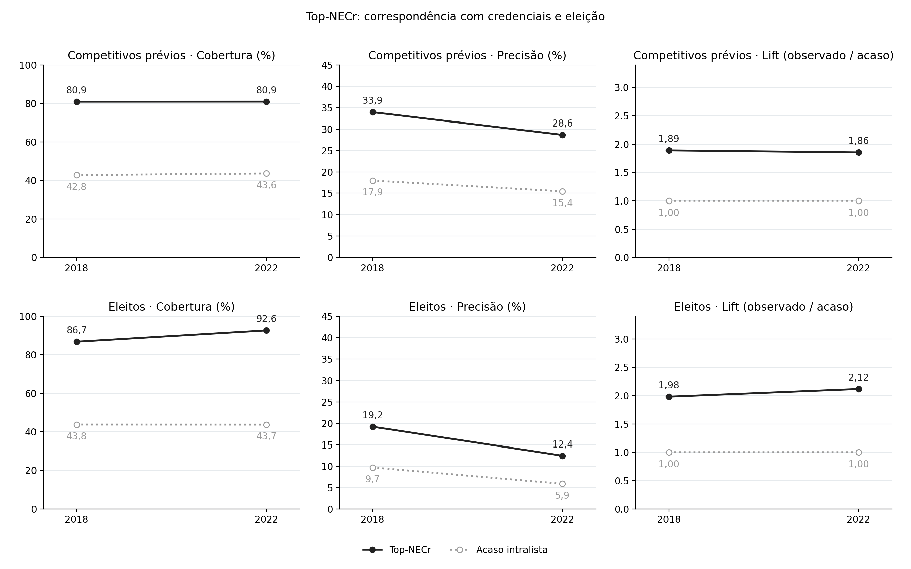

A segunda geração da literatura sobre os efeitos do voto preferencial passou a focar na capacidade de agência partidária para coordenação de suas nominatas, gerando estudos com resultados diferentes daqueles esperados pelos incentivos ao cultivo do voto pessoal registrados pelo cânone. Este capítulo se debruça sobre a capacidade de *gatekeeping* partidário para controle da competição intrapartidária em suas listas por intermédio dos recursos de campanha provenientes dos fundos públicos de financiamento.

Já se sabe que a distribuição destes recursos se manteve desigual entre candidaturas de uma mesma lista nas eleições pós-reforma do financiamento eleitoral [@silvacodato2024]. Todavia, apenas a constatação da desigualdade não é o mesmo que mostrar a priorização de candidaturas conforme a hipótese do *gatekeeping* partidário apresenta. A concentração de recursos dentro de uma lista reflete um conjunto de escolhas do próprio partido frente a regras que determinam percentuais de repasses para candidaturas negras e pardas e de mulheres. 

O capítulo examina a existência de uma estrutura na concentração do financiamento distribuído pelo partido. Para isso, compara grupos de candidaturas definidas como prioritárias pelos critérios escolhidos com o grupo de candidaturas competitivas e candidaturas posteriormente eleitas.

A conexão entre sinais pré-eleitorais de competitividade e o sucesso eleitoral das candidaturas com o grupo destacado como prioritário tem a capacidade de mostrar padrões consistentes de coordenação intrapartidária em nominatas. A presença de candidatos com histórico eleitoral de sucesso e que conquistaram sua eleição entre o subconjunto de candidaturas priorizadas de uma nominata indica priorização estratégica das legendas. Sendo este um padrão de resposta consistente com o contexto de financiamento partidário e eleitoral, que coloca no sucesso eleitoral de candidatos a deputado federal o grande definidor dos recursos que estarão disponíveis aos partidos em todo ciclo eleitoral posterior, inclusive para manutenção de seu funcionamento.

A base do argumento é a definição de um subconjunto priorizado de candidaturas dentro das nominatas. Não há uma medida direta para esta priorização, neste capítulo operacionaliza-se o núcleo partidário priorizado em recursos com a seleção dos candidatos no Top-NECr de cada lista. Como robustez, as métricas também são calculadas selecionando candidatos no Top-X% de recursos acumulados.

Os grupos formados por estes recortes do núcleo priorizado são comparados a dois elementos: i) uma referência pré-eleitoral identificando candidaturas com credenciais eleitorais prévias, e ii) e o próprio resultado eleitoral. 

Como as estratégias de operacionalização da seleção deste núcleo priorizado permite a identificação de candidaturas reais, utiliza-se métricas análogas às de modelos de classificação para validação pré e pós eleitoral do subconjunto selecionado como priorizado. 

O capítulo segue com a apresentação da estratégia de seleção do núcleo priorizado e seus testes de robustez, e em seguida apresenta seus resultados. O capítulo termina com uma discussão sobre os indicadores calculados.

## Dados, unidades de análise e operacionalização

### Universo empírico e recursos partidários

A análise utiliza registros de candidaturas, resultados eleitorais e prestação de contas provenientes do TSE. O universo reúne 7.630 candidaturas em 2018 e 9.675 em 2022. A candidatura é a unidade utilizada para identificar o histórico eleitoral e estimar a participação nos recursos. Para examinar a distribuição intrapartidária, essas observações são agregadas por partido, unidade da federação e eleição.

A base de dados composta, soma 859 listas em 2018 e 711 em 2022. Destas, 73 não receberam recursos partidários em 2018 e 63 nominatas em 2022. Dos candidatos nas listas sem recursos de partidos, três candidatos foram eleitos em 2018 e nenhum em 2022.   

### Seleção do núcleo de candidaturas priorizadas

As operacionalizações da seleção do núcleo de priorizados usam exclusivamente as informações da distribuição de financiamento de campanha provenientes de fundos públicos. A estratégia de seleção das candidaturas deste núcleo priorizado utiliza como referência uma medida de concentração da distribuição observada a partir dos próprios recursos partidários. Como testes de robustez, os resultados também são calculados de acordo com outras regras de seleção do núcleo.

#### Top-NECr

Para verificar a concentração de recursos entre candidaturas de uma mesma nominata, adapta-se o Número Efetivo de Partidos de @laaksotaagepera1979 e, seguindo @thomsen2023, calcula-se o Número Efetivo de Candidatos em recursos (NECr) para obter um indicador de candidaturas equivalentes em financiamento partidário dentro das nominatas. O NECr ao nível da nominata é calculado da seguinte maneira:

$$
NECr_l=\frac{1}{\sum_{i=1}^{C_l}s_{il}^{2}},
\qquad
s_{il}=\frac{R_{il}}{R_l},
\qquad
R_l=\sum_{i=1}^{C_l}R_{il}>0 .
$$ {#eq-necr}

Onde $R_i$ representa os recursos controlados por partidos políticos recebidos pelos candidatos.

Para obter-se uma medida endógena à distribuição para determinar o tamanho do núcleo de candidaturas priorizadas, a estratégia principal adotada é a seleção das Top-NECr candidaturas de cada nominata com recursos partidários positivos.

O NECr de cada lista é convertido em inteiro por $k_l=\lfloor NECr_l+0{,}5\rfloor$, um arredondamento convencional. As candidaturas são ordenadas pelos recursos partidários recebidos e as $k_l$ primeiras posições formam o núcleo. Se há empate na posição igual a $k_l$, as posições que restam são divididas igualmente entre as candidaturas empatadas. Em listas sem recursos partidários, não há definição de NECr e atribui-se $k_l=0$.

#### Top-X%

A segunda operacionalização proposta seleciona o *menor* subconjunto de copartidários em uma lista para concentrar pelo menos X% dos recursos partidários da nominata. Enquanto o Top-NECr é derivado da concentração da distribuição dos recursos, o Top-X% mantém fixo o grau de acúmulo dos recursos por um número de integrantes de uma lista.

$$
k^{\tau}_l=\min\left\{k\in\{1,\dots,C_l\}:\ \sum_{j=1}^{k}s_{(j)l}\ \ge\ \tau\right\},
\qquad \tau\in\{0{,}50;\,0{,}60;\,0{,}70;\,0{,}80;\,0{,}90;\,0{,}95\} .
$$ {#eq-ktopx}

### Validação dos grupos selecionados {#sec-validacao}

#### Desempenho eleitoral prévio {#sec-competitivos}

Esta classificação será utilizada para qualificar as credenciais eleitorais dos candidatos dentro dos subconjuntos priorizados definidos pelos critérios definidos acima. Constituem uma mensuração essencialmente *ex-ante* do desempenho eleitoral de candidaturas em eleições passadas.

Inspirado em @cheibubsin2020, para um candidato ser considerado competitivo em 2018, verificou-se o histórico eleitoral deste candidato desde 1998 à 2016, e para 2022, o histórico de 1998 a 2018. Uma candidatura à eleição do ano $y$ é classificada como competitiva se, em alguma eleição anterior a $y$, o candidato: (i) venceu a disputa para Presidente, Governador, Senador, Deputado Federal, Deputado Estadual ou Prefeito; ou (ii) obteve ao menos 10% do quociente eleitoral em disputa proporcional para Deputado Federal ou Deputado Estadual.

$$
\text{Competitivo}_{iy} =
\begin{cases}
1 & \text{se, antes de } y,\ i \text{ satisfez (i) ou (ii)} \\
0 & \text{caso contrário}
\end{cases}
$$ {#eq-competitivo}

As regras de classificação adapta a proposta de @cheibubsin2020. Os autores consideraram também como competitivos os candidatos que atingiram ao menos 10% do quociente eleitoral das eleições sob análise. Isto está em desacordo com o princípio temporal, motivo pelo qual deliberadamente descarta-se como competitivos os candidatos que tiveram performance surpreendente.

#### Cobertura, precisão e lift {#sec-metricas}

As operacionalizações do núcleo priorizado informam o número de candidaturas equivalentemente financiadas pelos partidos ou os candidatos que estão no topo da distribuição. O exercício de validação que será realizado verifica qual parcela dos grupos de referência pré e pós eleitorais o núcleo selecionado alcança. O indicador de validação utilizado é análogo aos que são calculados para testar modelos de classificação. Porém não guardam outra similaridade além desta inspiração. Não há treinamento de modelos.

Para validar a relevância eleitoral do indicador calculado, pode-se ordenar cada uma das listas de acordo com os repasses partidários para cada candidatura, e, na sequência selecionar os candidatos do Top-NECr de tal lista. Este subgrupo dentro da nominata destaca o núcleo de competidores priorizado pelo partido na distribuição intralista de seus recursos.

Este recorte na nominata é utilizado para calcularmos a cobertura e precisão da alocação partidária.

Cada lista $l$ tem $C_l$ candidaturas e um núcleo de tamanho $k_l$. Para cada candidatura $i$ da lista, $g_{il}$ vale um se ela pertence ao grupo de referência e zero caso contrário; $G_l = \sum_i g_{il}$ é o número de candidaturas do grupo de referência na lista. O pertencimento ao núcleo é dado por $w_{il}$: vale 1 para as candidaturas acima da fronteira do núcleo, 0 para as que ficam fora, e uma fração quando há empate de recursos exatamente na posição $k_l$. As posições que restam são divididas igualmente entre as candidaturas empatadas, de modo que $\sum_i w_{il} = k_l$ em toda lista. O acerto da lista é o número de candidaturas do grupo de referência que estão no núcleo:
 
$$
H_l = \sum_{i=1}^{C_l} w_{il}\, g_{il}.
$$ {#eq-acerto}
 

$H_l$ pode ser fracionário quando a fronteira cai sobre um bloco empatado; fora isso, é uma contagem. Os três indicadores são calculados nacionalmente, somando as listas:
 
$$
\text{Cobertura} = \frac{\sum_l H_l}{\sum_l G_l},
\qquad
\text{Precisão} = \frac{\sum_l H_l}{\sum_l k_l},
\qquad
\text{Lift} = \frac{\sum_l H_l}{\sum_l G_l\, k_l / C_l}.
$$ {#eq-indicadores}

A cobertura é lida como a parcela de candidaturas competitivas (ou eleitas) que estão no núcleo selecionado em suas listas. Para tanto, divide-se os acertos pelo tamanho do grupo de referência. A precisão é a parcela das posições do núcleo que são ocupadas por candidaturas presentes no grupo de referência.

Estas duas métricas são sensíveis ao tamanho do núcleo selecionado, mas de maneira distinta. Núcleos maiores elevam por construção a taxa de cobertura, pois adicionam mais candidaturas. Porém o mesmo não vale para a precisão, ela só diminui se as candidaturas incorporadas a cada ampliação forem menos densas no grupo de referência do que as já presentes no núcleo. Para lidar com esta distinção, calcula-se o *lift*, que é a razão entre os acertos observados no núcleo e os acertos esperados caso o núcleo de cada lista fosse composto sem relação com o grupo de referência. Este valor de referência do *lift* é obtido analiticamente: se um subconjunto de tamanho $k_l$ fosse extraído ao acaso, sem reposição, entre as $C_l$ candidaturas da lista $l$, o número esperado de candidaturas no grupo de referência nele contidas seria $G_l\,k_l/C_l$.

O valor *lift* igual a 1 indica que o núcleo reúne exatamente o número de candidaturas que os tamanhos envolvidos já implicariam; valores acima de um indicam sobrerrepresentação e valores abaixo, sub-representação.

Estas métricas calculadas sobre o grupo de candidatos eleitos são lidas como validação *ex-post*. Elas misturam a ação partidária da priorização do efeito do dinheiro sobre a vitória eleitoral do candidato.

## Resultados

### Amplitude das nominatas e concentração dos recursos

Dos 7.630 candidatos a Deputado Federal em 2018, 973 (12,75%) foram classificados como "competitivos" pelos critérios adaptados de @cheibubsin2020. Em 2022, foram 9.675 candidaturas com 1.354 (13,99%) competitivas. Houve um aumento desproporcional dentro do grupo de candidaturas competitivas: enquanto o total de candidatos lançados aumentou 27%, o total de competitivas cresceu 39% no período.

A @fig-amplitude apresenta a amplitude formal e efetiva das nominatas financiadas. No período estudado, a lista partidária mediana possuiu quatro candidatos em 2018 e nove em 2022. A média de candidaturas foi maior, indicando uma distribuição com cauda à direita. Quando se limitam às candidaturas classificadas como competitivas por seu histórico eleitoral, os números são bem menores, em consonância com as evidências de @cheibubsin2020. Em 2018 e 2022, a mediana de candidaturas competitivas por lista é igual a um candidato. A média, respectivamente, é de 1,22 e 2,09 candidatos.

{#fig-amplitude fig-align="center" width="100%"}

O Número Efetivo de Candidaturas em recursos, o NECr, também cresce: em 2018, na mediana, partidos concentraram recursos em 1,88 candidato efetivo equivalente; em 2022, esse número passou a 4,81 candidaturas.

O argumento de @cheibubsin2020 parte de resultados que estão marcados nesta redução entre o número de candidatos lançados formalmente e um afunilamento de candidatos competitivos segundo o histórico eleitoral. Destacam que as listas abertas no Brasil são controladas pelas lideranças dos partidos políticos no momento de sua elaboração, ao lançarem poucas candidaturas competitivas em suas nominatas.

Ao considerarmos a concentração de recursos intralista pelo NECr, busca-se verificar justamente se esta redução também está presente ao considerar a alocação partidária dos recursos dos fundos públicos. Embora o NECr seja maior que as candidaturas competitivas na média e mediana para as duas eleições observadas, ainda assim destaca-se um conjunto de candidaturas menor do que o tamanho total da lista.

A @fig-concentracao compara o número formal de candidatos ao NECr nas nominatas financiadas. A lista mediana possuía 1,95 e 1,86 candidato formal para cada candidato efetivo em termos de recursos de campanha partidários em 2018 e 2022, respectivamente. Ao inverter o indicador, vê-se que a proporção mediana de candidaturas efetivas foi de 51,36% e 53,65% do tamanho das nominatas nas eleições estudadas.

{#fig-concentracao fig-align="center" width="100%"}

A figura de concentração mostra ainda uma visão complementar para pensar o aumento de candidaturas em 2022. Enquanto há mais candidatos sendo lançados e mais candidatos recebendo recursos efetivamente, a concentração relativa permaneceu próxima: a média de $C/NECr$ caiu de 3,29 para 2,67, enquanto a média de $NECr/C$ passou de 56,18% para 55,40%.

Em conjunto, os resultados reforçam o argumento de @cheibubsin2020 sobre o afunilamento das candidaturas quando se considera a competitividade prévia e concentração de recursos partidários intralista. Há indicativos de que apenas a metade das candidaturas são financiadas por seus partidos de maneira efetiva. Todavia, apenas estes indicadores não sustentam sozinhos a ideia de priorização financeira. A seção seguinte operacionaliza o núcleo partidário priorizado em recursos e valida as seleções realizadas por diferentes critérios.

### Priorização financeira pelo Top-NECr

Na primeira linha da @fig-cap3-03-top-necr, apresenta-se a cobertura, precisão e *lift* calculados pela correspondência entre o núcleo priorizado identificado pelo Top-NECr de cada nominata e o grupo de candidatos competitivos identificados pelo histórico eleitoral.

Entre as candidaturas com credenciais eleitorais prévias, mais de 80% compõem o núcleo identificado pelo Top-NECr nas eleições de 2018 e 2022. Isso indica que o grupo priorizado, de acordo com o recorte proposto, cobre 4/5 dos candidatos classificados como competitivos. Dito de outra maneira, parte majoritária dos candidatos competitivos está entre os candidatos que concentram os recursos de suas listas. O valor de referência, que preserva o tamanho de cada lista e de cada núcleo, tem resultado inferior: 42,8 e 43,6% em 2018 e 2022, respectivamente.

A precisão nos mostra que 33,9 e 28,6% dos candidatos selecionados no núcleo Top-NECr estão entre os classificados como competitivos em 2018 e 2022, respectivamente. Um núcleo do mesmo tamanho, construído sem relação com o histórico eleitoral das candidaturas, conteria 17,9 e 15,4% de competitivos.

O *lift* resume as comparações anteriores em um número: 1,89 em 2018 e 1,86 em 2022. Isto representa que o núcleo Top-NECr apresenta quase 90% mais candidaturas competitivas do que seria esperado pelo tamanho das listas e do próprio núcleo.

A segunda linha de @fig-cap3-03-top-necr repete o exercício de correspondência do Top-NECr, mas desta vez a referência passa a ser o sucesso eleitoral posterior das candidaturas. Entre os candidatos no núcleo Top-NECr de suas listas, estão 86,7% dos eleitos em 2018 e 92,6% dos eleitos em 2022. Proporções que representam o dobro daquelas esperadas aleatoriamente.

Já a precisão é de 19,2 e 12,4% em 2018 e 2022. Esta menor proporção reflete sobretudo o tamanho menor do alvo analisado. As eleições para a câmara baixa elegem 513 deputados. Estas taxas de precisão seguem duas vezes maiores quando comparadas ao seu *benchmark* aleatório. O *lift* confirma que essa diferença não vem do tamanho dos grupos selecionados pelo Top-NECr: o núcleo reúne 1,98 vez o número de eleitos esperado em 2018 e 2,12 vez em 2022. Isto é, cerca do dobro, em ambos os ciclos, do que teria um núcleo de mesmo tamanho composto sem relação com o resultado eleitoral.

{#fig-cap3-03-top-necr fig-align="center" width="100%"}

A @tbl-cap3-01-lift-magnitude apresenta o cálculo do *lift* agregados para cada grupo de magnitude de distrito. Nota-se que os resultados são sempre crescentes na medida em que o número de cadeiras em disputa também cresce. Isso ocorre em todas as comparações realizadas, considerando tanto as candidaturas previamente competitivas quanto o número de eleitos posteriormente. Isso indica que, relativamente ao tamanho da nominata, o núcleo financiado pelo partido se torna mais discriminante nos distritos de maior magnitude. 

| Magnitude      | Competitivos 2018 | Competitivos 2022 | Eleitos 2018 | Eleitos 2022 |
|---------------|---------------|---------------|---------------|---------------|
| Pequeno (8–12) | 1,40              | 1,37              | 1,50         | 1,44         |
| Médio (16–31)  | 1,96              | 2,00              | 2,07         | 2,40         |
| Grande (39–70) | 2,52              | 2,37              | 2,45         | 2,63         |
: {#tbl-cap3-01-lift-magnitude}

### Robustez da operacionalização

#### Sensibilidade ao limiar Top-X%

Para avaliar a sensibilidade dos achados deste capítulo sobre a arbitrariedade do recorte do núcleo de candidaturas priorizadas pelo Top-NECr, utiliza-se o número mínimo de candidatos que são necessários para alcançar a concentração de $i$% dos recursos da lista, com $i$ sendo definido nos patamares de 50, 60, 70, 80, 90 e 95% dos recursos partidários.

A @fig-cap3-04-topx-competitividade mostra um padrão consistente entre as métricas de 2018 e 2022. Ao considerarmos um recorte restrito do número de candidaturas no Top-50% dos recursos partidários, há mais de 50% de cobertura do núcleo priorizado entre os candidatos classificados como competitivos. Na medida em que o limiar percentual aumenta, a cobertura também cresce, tendo em vista que limiares maiores incluem mais candidatos e acabam selecionando mais candidatos competitivos também, conforme o esperado pela construção da métrica definida em @sec-metricas.

Quanto mais se restringe o núcleo ao topo da distribuição de recursos de campanha partidários, maior é a presença desproporcional de candidaturas previamente definidas como competitivas entre os candidatos que estamos tratando como priorizados. Isto ocorre nos dois ciclos eleitorais observados e não é fruto de variação no tamanho das nominatas dos partidos, o *lift* normaliza essa variação pelo valor de referência de cada lista e permanece acima de um em todos os limiares. Mesmo no Top-95%, o corte mais permissivo calculado, ele é 1,55 em 2018 e 1,37 em 2022.

Destaca-se também a diferença entre as taxas de cobertura e precisão e suas referências aleatórias. Sistematicamente há mais candidaturas competitivas dentro do núcleo priorizado do que fora.

{#fig-cap3-04-topx-competitividade fig-align="center" width="100%"}

Já a @fig-cap3-05-topx-eleicao apresenta os testes realizados com o resultado eleitoral posterior como referência para a composição dos núcleos de priorização formados em cada um dos níveis de operacionalização da robustez. A cobertura de candidaturas eleitas dentro do subconjunto priorizado é mais alta do que quando se considera as candidaturas competitivas como referência. A precisão também guarda a trajetória que indica que as candidaturas no topo da distribuição tem um número de candidatos eleitos sobrerrepresentado. Os resultados estão todos acima do que seria esperado ao acaso, e os valores de *lift* calculados sempre estão acima de um.

{#fig-cap3-05-topx-eleicao fig-align="center" width="100%"}

## Discussão {#sec-discussao-cap3}
 
Os testes realizados neste capítulo sustentam a hipótese de que partidos políticos priorizam candidaturas em suas nominatas. Isto foi evidenciado pela análise de um núcleo de competidores financiado diretamente pelos partidos políticos. Em todas as operacionalizações usadas, o *lift* calculado é superior a um. Ou seja, partidos políticos sistematicamente priorizam, acima do esperado ao acaso, com um maior volume de recursos as candidaturas previamente estabelecidas como competitivas e de candidatos que posteriormente são eleitos.

A seleção do núcleo a partir do Top-NECr é permissiva, com 2,3 mil candidatos em 2018 e 3,8 mil em 2022. Portanto, parte da alta cobertura se deve a essa amplitude. A queda da precisão entre as eleições estudadas também revela o crescimento do núcleo, já que a própria média do NECr aumentou de 2,96 em 2018 para 5,90 em 2022. Ainda assim, os valores de *lift* apresentados mostram que mesmo descontando o tamanho dos grupos, o núcleo Top-NECr acerta o dobro de vezes em uma comparação com seleção ao acaso.

O aumento do NECr evidenciado entre 2018 e 2022, contudo, não sugere exatamente menos concentração, visto que a proporção de candidaturas efetivas em financiamento partidário se manteve estável nos dois anos. Este crescimento entre uma eleição e outra é compatível com o esperado após o fim das coligações para as eleições proporcionais, situação em que partidos deixam de contar com votos de partidos coligados para somar seu quociente partidário. A própria proporção de candidaturas dentro do núcleo Top-NECr em relação ao total de candidaturas lançadas, que é de 30,4% em 2018 e 39,5% em 2022, indica que o grupo de concorrentes priorizados segue relativamente pequeno.

Com a análise de sensibilidade da seleção do núcleo pelo Top-X%, nota-se o efeito da amplitude deste subconjunto. No núcleo definido pelo menor número de candidatos que atingem o Top-50% dos recursos partidários destinados à lista, a precisão e o *lift* têm sua maior taxa em comparação com os demais recortes. Estes indicadores caem de maneira progressiva conforme o núcleo passa a considerar recortes maiores. Esta evolução sugere uma distribuição de recursos em "camadas", com poucos candidatos recebendo a maior parte do dinheiro, uma camada intermediária bem financiada e uma longa cauda de candidaturas que recebe pouco ou nada. 

O resultado do *lift* por magnitude do distrito é particularmente informativo, já que a literatura indica que magnitudes maiores representam um aumento no universo de competidores e na própria competição intrapartidária [@careyshugart1995]. Nestes grandes distritos, partidos, candidatos e eleitores encontram uma tarefa árdua para distinguir a viabilidade das candidaturas individuais [@cox1997]. Com este cenário, a extensão do argumento seria o de se esperar uma menor capacidade de partidos políticos de priorizarem candidaturas eleitoralmente relevantes. Contudo, os resultados apontam na direção contrária, com partidos sistematicamente distinguindo melhor suas candidaturas relevantes nestes grandes distritos.  

Por mais que a análise da distribuição e concentração de recursos esteja mais próximo à estratégia partidária do que analisá-la pelos resultados eleitorais, parte do observado neste capítulo não é fruto apenas da escolha de partidos. Desde as eleições de 2018, partidos devem destinar ao menos 30% do FEFC às candidaturas femininas. Já desde 2022, devem repassar recursos a candidaturas negras na proporção em que estas aparecem nas nominatas. Claro que partidos podem selecionar as candidaturas de mulheres e negros de acordo com o currículo eleitoral destes candidatos, mas a histórica subrrepresentação destes grupos acaba por influenciar diretamente a ausência destes concorrentes entre as candidaturas classificadas como competitivas. Em 2018, apenas 4,68% das mulheres no universo são classificadas como competitivas, contra 15,83% dos homens; em 2022, as proporções são 5,79% e 17,20%, respectivamente.

Não se pode afirmar, por esta e outras razões, que partidos preveem quais são as candidaturas que serão eleitas. O que se pode afirmar com os resultados encontrados é que a distribuição dos recursos controlados pelos partidos em cada uma de suas listas possui uma estrutura. Esta estrutura é reconhecível pelas próprias transferências monetárias aos candidatos e está alinhada à competitividade prévia dos candidatos e ao próprio resultado eleitoral. Esta priorização se mantém visível em todos os níveis de magnitude do distrito, sendo ainda mais informativa em termos eleitorais nos distritos grandes do que nos médios e pequenos.

Estas são evidências de que o partido prioriza candidaturas eleitoralmente relevantes com seus recursos e o aspecto mais importante a ser destacado é que isso pode ser observado mesmo antes da votação ocorrer. Este capítulo focou justamente na observação desta priorização, mas não revela mais do que isso. Para verificar estritamente a intencionalidade dos partidos, seria necessário um desenho quase experimental. Com os dados observacionais, entretanto, pode-se chegar ainda mais próximo da verificação desta intenção, ainda que não a identificando causalmente. Este será o foco do próximo capítulo, que verifica a construção deste núcleo de candidaturas priorizadas financeiramente ao longo do período da campanha pela análise dos registros datados de transferências entre partidos e candidatos.