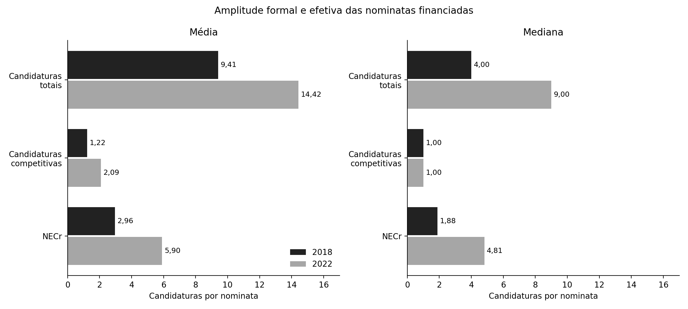
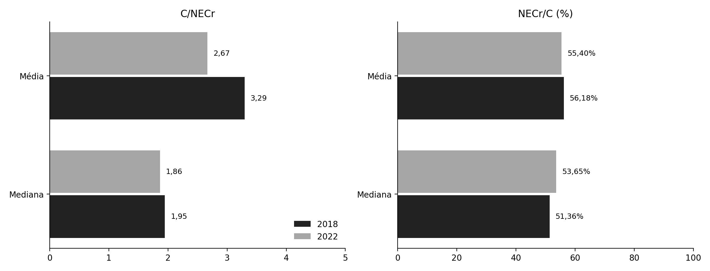
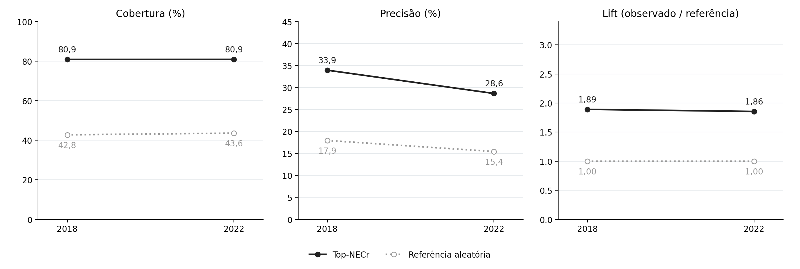
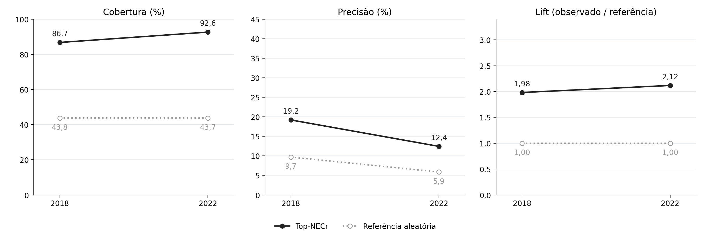
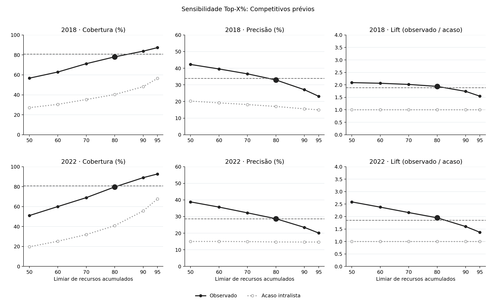
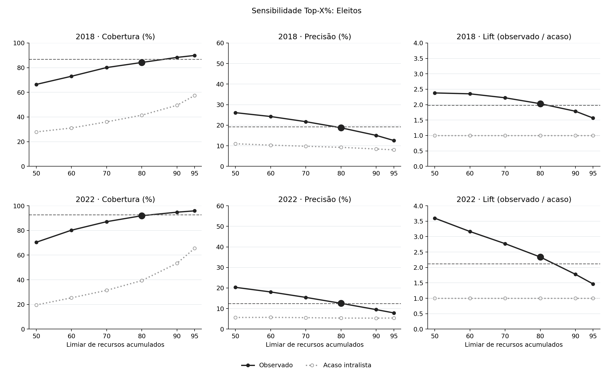

# A priorização pelo volume de recursos {#sec-cap3}

Este capítulo examina se partidos priorizam candidaturas a deputado federal que possuem credenciais eleitorais prévias, conforme expectativa apresentada na @sec-argumento. Para isso, identifica um núcleo de candidaturas que concentra recursos partidários em cada lista nas eleições para deputado federal de 2018 e 2022.

Após apresentar os dados e as medidas, o capítulo mostra que candidaturas com credenciais prévias estão sobrerrepresentadas no núcleo priorizado com relação a uma referência aleatória. Candidaturas que são posteriormente eleitas também estão presentes acima do esperado neste núcleo. A consistência do resultado permanece com outras formas de delimitar o núcleo priorizado. As credenciais prévias também estão sistematicamente associadas a maiores parcelas de recursos entre candidatos de uma mesma lista.

## Dados {#sec-dados}

A análise utiliza registros de candidaturas, resultados eleitorais e prestação de contas provenientes do Portal de Dados Abertos do TSE. O universo reúne 7.630 candidaturas em 2018 e 9.675 em 2022.

O histórico eleitoral de cada candidatura destas eleições foi verificado pelo CPF, com verificação retroativa até as eleições de 1998, que são as primeiras com a identificação por este documento disponível. Os concorrentes de 2018 e 2022 são vinculados a contagens de suas vitórias eleitorais anteriores para cada cargo disputado. Ocorrências de ex-presidentes nesta contagem são desconsideradas devido a baixa frequência da categoria na base de dados.

A análise dos repasses partidários provém da base de receitas dos candidatos, identificando os registros com origem igual a "recursos de partidos políticos". Estes incluem os recursos do Fundo Partidário e Fundo Especial de Financiamento de Campanhas.

A base de dados composta soma 859 listas em 2018 e 711 em 2022. Destas, 73 não receberam recursos partidários em 2018 e 63 nominatas em 2022. Dos candidatos nas listas sem recursos de partidos, três candidatos foram eleitos em 2018 e nenhum em 2022.

## Seleção do núcleo priorizado: Top-NECr

O tamanho do núcleo priorizado é calculado por uma medida endógena à distribuição dos recursos de campanha em cada lista. Uma adaptação do Número Efetivo de Partidos de @laaksotaagepera1979 proposta por @thomsen2023: o Número Efetivo de Candidatos em recursos (NECr). O NECr ao nível da nominata é calculado da seguinte maneira:

$$
NECr_l=\frac{1}{\sum_{i=1}^{C_l}s_{il}^{2}},
\qquad
s_{il}=\frac{R_{il}}{R_l},
\qquad
R_l=\sum_{i=1}^{C_l}R_{il}>0 .
$$ {#eq-necr}

Onde $R_{il}$ representa os recursos controlados por partidos políticos recebidos pelos candidatos.

O NECr de cada lista é convertido em inteiro por $k_l=\lfloor NECr_l+0{,}5\rfloor$, um arredondamento convencional. As candidaturas são ordenadas de maneira decrescente pelos recursos partidários recebidos e as $k_l$ primeiras posições formam o Top-NECr. Se há empate na posição igual a $k_l$, as posições que restam são divididas igualmente entre as candidaturas empatadas. Em listas sem recursos partidários, não há definição de NECr e atribui-se $k_l=0$.

## Credenciais eleitorais prévias {#sec-competitivos}

Para analisar a composição do *núcleo de priorizados* propõe-se um indicador binário que classifica uma *candidatura competitiva*[^03-medindo-coordenacao-intrapartidaria-1], mas o faz considerando algum sinal positivo de desempenho anterior. Portanto, para se considerar um candidato com credencial eleitoral prévia, seleciona-se para as eleições no ano $y$ aquelas que tenham, antes de $y$: i) sido eleitas em alguma disputa para Governador, Senador, Deputado Federal, Deputado Estadual ou Prefeito; ou ii) que obtiveram ao menos 10% do quociente eleitoral em disputa proporcional para Deputado Federal ou Deputado Estadual.

[^03-medindo-coordenacao-intrapartidaria-1]: Note-se que os termos "candidaturas com credenciais eleitorais prévias" e "candidaturas competitivas" se referem ao mesmo conjunto de concorrentes e são usados de maneira intercambiada.

Estas regras de identificação de credenciais eleitorais prévias adaptam a proposta de @cheibubsin2020. Os autores consideraram também como competitivos os candidatos que atingiram ao menos 10% do quociente eleitoral das eleições sob análise. Isto está em desacordo com o princípio temporal, motivo pelo qual deliberadamente descarta-se como competitivos os candidatos novatos que tiveram performance surpreendente.

### Composição do núcleo priorizado e credenciais eleitorais {#sec-metricas}

<!-- ROTEIRO [3.4]. STA-3-003 (run-002, MODERATE): o exemplo de uma nominata (tbl-resumo-indicadores) introduz cobertura, precisão e lift de forma didática, mas não diz como as listas se agregam ao número nacional usado nos Resultados. A agregação é uma razão de somas ponderada (cobertura = ΣH/ΣG; precisão = ΣH/Σk; lift = ΣH/Σ(Gk/C)), e não a média das métricas de cada lista. A diferença é substantiva: para o Top-NECr competitivo de 2018, a precisão nacional é 33,94%, mas a média das precisões por lista (com k>0) é 41,65% — 7,7 p.p. de diferença, não é arredondamento. Recomendação do run-002: inserir a regra de agregação nesta seção (ou no apêndice formal) e dizer explicitamente que os números da seção de Resultados são razões de somas nacionais, não a experiência da lista típica. -->

Para analisar a composição do núcleo priorizado são calculados três indicadores: precisão, cobertura e *lift*; e uma referência aleatória. A definição formal destas métricas estão no @sec-apendice-formal. 

A @tbl-resumo-indicadores detalha o cálculo dos indicadores em um cenário fictício e a pergunta substantiva que respondem. Para interpretá-la, considere um cenário de uma nominata com 12 candidatos, dos quais 4 tiveram credenciais eleitorais prévias identificadas. O núcleo priorizado selecionado pelo Top-NECr desta nominata reúne 3 candidatos, sendo 2 deles com credenciais prévias.

| Medida | Pergunta que responde | Conta |
|:-------------|:--------------------------------------|----------:|
| Precisão | Dos candidatos priorizados, quantos possuem credenciais? | $2 \div 3 \approx 66{,}7\%$ |
| Cobertura | Dos candidatos com credenciais, quantos foram priorizados? | $2 \div 4 = 50\%$ |
| Referência aleatória | Quantos candidatos com credenciais esperaríamos encontrar ao selecionar 3 dos 12 candidatos ao acaso? | $3 \times (4 \div 12) = 1$ |
| *Lift* | Quantos acertos observamos em relação ao esperado ao acaso? | $2 \div 1 = 2$ |

: Indicadores de composição do núcleo priorizado em um cenário fictício {#tbl-resumo-indicadores tbl-colwidths="[20,55,25]"}

O *lift* igual a 2 neste cenário indica que esta nominata possui um núcleo priorizado com uma frequência de candidaturas com credenciais prévias equivalente ao dobro do que seria esperado em uma seleção de um grupo de mesmo tamanho ao acaso.

Estas métricas são calculadas sobre as diferentes operacionalizações de seleção do núcleo priorizado. Como análise complementar, também são computadas considerando as candidaturas posteriormente eleitas, constituindo uma validação *ex-post* do núcleo selecionado. Estes testes, entretanto, são "contaminados" pelo resultado eleitoral visto que este é uma função da interação entre partidos, candidatos e eleitores.

## Resultados

### Amplitude das nominatas e concentração dos recursos

Dos 7.630 candidatos a Deputado Federal em 2018, 973 (12,75%) foram classificados como "competitivos" pelos critérios adaptados de @cheibubsin2020. Em 2022, foram 9.675 candidaturas com 1.354 (13,99%) competitivas. Houve um aumento desproporcional dentro do grupo de candidaturas competitivas: enquanto o total de candidatos lançados aumentou 27%, o total de competitivas cresceu 39% no período.

A @fig-amplitude apresenta a amplitude formal e efetiva das nominatas financiadas. Calculando-se a partir da base criada para a tese, a lista partidária mediana possuiu quatro candidatos em 2018 e nove em 2022. A média de candidaturas foi maior, indicando uma distribuição com cauda à direita. Quando se limitam às candidaturas com credenciais eleitorais prévias, os números são bem menores, em consonância com as evidências de @cheibubsin2020. Em 2018 e 2022, a mediana de candidaturas competitivas por lista é igual a um candidato. A média, respectivamente, é de 1,22 e 2,09 candidatos.

{#fig-amplitude fig-align="center" width="100%"}

O Número Efetivo de Candidaturas em recursos, o NECr, também cresce: em 2018, na mediana, partidos concentraram recursos em 1,88 candidato efetivo equivalente; em 2022, esse número passou a 4,81 candidaturas.

O argumento de @cheibubsin2020 parte de resultados que estão marcados nesta redução entre o número de candidatos lançados formalmente e um afunilamento de candidatos competitivos segundo o histórico eleitoral. Destacam que as listas abertas no Brasil são controladas pelos partidos no momento de sua elaboração, ao lançarem poucas candidaturas competitivas em suas nominatas.

Ao considerarmos a concentração de recursos intralista pelo NECr, busca-se verificar justamente se esta redução também está presente ao considerar a alocação partidária dos recursos dos fundos públicos. Embora o NECr seja maior que as candidaturas competitivas na média e mediana para as duas eleições observadas, ainda assim destaca-se um conjunto de candidaturas menor do que o tamanho total da lista.

A @fig-concentracao compara o número formal de candidatos ao NECr nas nominatas financiadas. A lista mediana possuía 1,95 e 1,86 candidato formal para cada candidato efetivo em termos de recursos de campanha partidários em 2018 e 2022, respectivamente. Ao inverter o indicador, vê-se que a proporção mediana de candidaturas efetivas foi de 51,36% e 53,65% do tamanho das nominatas nas eleições estudadas.

{#fig-concentracao fig-align="center" width="55%"}

Em conjunto, os resultados reforçam o argumento de @cheibubsin2020 sobre o afunilamento das candidaturas quando se considera a competitividade prévia e concentração de recursos partidários intralista. Todavia, apenas estes indicadores não sustentam sozinhos a ideia de priorização financeira. A seção seguinte operacionaliza o núcleo partidário priorizado em recursos e valida as seleções realizadas por diferentes critérios.

### Priorização financeira pelo Top-NECr

A @fig-cap3-03-top-necr apresenta a cobertura, precisão e *lift* calculados pela correspondência entre o núcleo priorizado identificado pelo Top-NECr de cada nominata e as candidaturas com credenciais eleitorais prévias.

Entre as candidaturas competitivas, mais de 80% compõem o núcleo identificado pelo Top-NECr nas eleições de 2018 e 2022. Isso indica que o grupo priorizado, de acordo com o recorte proposto, cobre 4/5 dos candidatos classificados como competitivos. Dito de outra maneira, parte majoritária dos candidatos competitivos está entre os candidatos que concentram os recursos de suas listas. O valor de referência aleatório, que preserva o tamanho de cada lista e de cada núcleo, tem resultado inferior: 42,8 e 43,6% em 2018 e 2022, respectivamente.

A precisão nos mostra que 33,9 e 28,6% dos candidatos selecionados no núcleo Top-NECr estão entre os classificados como competitivos em 2018 e 2022, respectivamente. Um núcleo do mesmo tamanho, construído sem relação com o histórico eleitoral das candidaturas, conteria 17,9 e 15,4% de competitivos.

<!-- [3.6-1] Lembrar aqui a ressalva de agregação de STA-3-003 [3.4]: estes 33,9%/28,6% são razões de somas nacionais (ΣH/Σk), não a precisão média de uma lista típica (que seria maior: 41,65% em 2018). Uma nota de rodapé ou uma frase curta evitaria que o leitor infira a experiência de uma lista mediana a partir do número nacional. -->

O *lift* resume as comparações anteriores em um número: 1,89 em 2018 e 1,86 em 2022. Isto representa que o núcleo Top-NECr apresenta quase 90% mais candidaturas competitivas do que seria esperado ao acaso pelo tamanho das listas e do núcleo.

{#fig-cap3-03-top-necr fig-align="center" width="100%"}

A @tbl-cap3-01-lift-magnitude apresenta o cálculo do *lift* agregado para cada grupo de magnitude de distrito. Nota-se que os resultados são sempre crescentes na medida em que o número de cadeiras em disputa também cresce. Isso ocorre nas duas eleições observadas. Isso indica que, relativamente ao tamanho da nominata, o núcleo financiado pelo partido se torna mais discriminante nos distritos de maior magnitude.

| Magnitude      | Competitivos 2018 | Competitivos 2022 |
|----------------|-------------------|-------------------|
| Pequeno (8–12) | 1,40              | 1,37              |
| Médio (16–31)  | 1,96              | 2,00              |
| Grande (39–70) | 2,52              | 2,37              |
: {#tbl-cap3-01-lift-magnitude}

### Prêmio intralista das credenciais eleitorais prévias {#sec-premio-credenciais}

O Top-NECr depende de um corte que separa o núcleo priorizado do restante da nominata. Esta seção examina a mesma relação sem esse corte, usando toda a distribuição dos recursos partidários dentro de cada lista. A pergunta passa a ser se candidaturas com credenciais eleitorais prévias recebem uma parcela maior dos recursos do que seus correligionários, e não apenas se estão entre os mais financiados. Como a base registra, para cada candidatura, o número de vitórias anteriores por cargo desde 1998 (@sec-dados), é possível também verificar quais credenciais pesam mais nessa alocação.

A variável dependente é a parcela intralista de recursos partidários, $s_{il}=R_{il}/R_l$, a mesma razão empregada no cálculo do NECr. O modelo pertence à família de modelos fracionários de @papke1996, com uma diferença: a parcela esperada de cada candidatura é definida em relação às demais candidaturas da mesma lista,

<!-- [3.7-1] A equação e a explicação do cancelamento do denominador comum (parágrafo seguinte, "Tudo o que é comum...") estão corretas e bem power aided por C3.8.02 do run-002 (razão entre correligionários = exp((x_i-x_j)β), sem o denominador da lista — supported). Nenhuma ação aqui. -->

$$
E[s_{il}\mid X_l]=\frac{\exp(x_{il}'\beta)}{\sum_{j=1}^{C_l}\exp(x_{jl}'\beta)} .
$$

Tudo o que é comum aos integrantes de uma lista se cancela entre o numerador e o denominador dessa expressão: o tamanho da nominata, a magnitude do distrito, o partido, a UF e o volume total de recursos. Os coeficientes resultam, assim, apenas da comparação entre correligionários que disputam a mesma eleição no mesmo distrito, como no Top-NECr. O modelo equivale a uma regressão de Poisson da parcela com efeitos fixos de lista. Os erros-padrão são clusterizados por lista, e as estimações são feitas separadamente para 2018 e 2022, dadas as mudanças institucionais entre os pleitos.

Os resultados são apresentados como razões de parcelas. Para duas candidaturas da mesma lista, a razão entre suas parcelas esperadas é $\exp\big((x_{il}-x_{jl})'\beta\big)$. Assim, $\exp(\beta)$ indica quantas vezes a parcela esperada de uma candidatura supera a de um correligionário que difere dela apenas em uma unidade do atributo considerado. Essa razão não depende do tamanho da lista nem da composição das demais candidaturas, o que permite comparar eleições e magnitudes. Os efeitos em pontos percentuais da parcela, por sua vez, diminuem mecanicamente à medida que as nominatas crescem, porque a parcela média de cada candidatura fica menor. Nas contagens de vitórias, a razão se refere a cada vitória adicional e se acumula de forma multiplicativa.

<!-- [3.7-2] Esta é a passagem certa para introduzir, também, a ressalva de STA-3-001 sobre os AMEs em pontos percentuais (mencionados adiante, "Em pontos percentuais..."): eles são a média de uma mudança individual 0→1 mantendo os colegas fixos e recalculando o denominador softmax — não é a mesma coisa que a razão $\exp(\beta)$ entre dois correligionários simultâneos. STA-3-004 do run-002 (MODERATE) aponta que a frase atual ("essas diferenças equivalem, em média, a X pontos") sugere uma conversão única entre razão e pontos percentuais, que não existe. Recomendação: nomear os pontos percentuais como "efeito médio previsto da mudança individual, mantendo os demais integrantes fixos". -->

As covariáveis de interesse reproduzem, de forma desagregada, os critérios usados para identificar as credenciais na @sec-competitivos. O primeiro critério, a vitória anterior, entra como contagem de vitórias por cargo. O segundo, a votação de ao menos 10% do quociente eleitoral em disputa proporcional anterior, entra como indicador restrito às candidaturas sem vitória acima de vereador, pois é somente para elas que esse critério altera a classificação. A contagem de vitórias para vereador, que não integra a definição de credencial, também é incluída, assim como a proporção de votos nominais obtida pela candidatura em sua lista na eleição anterior para deputado federal. Como controles, entram indicadores de candidatura de mulher e de pessoa negra, grupos aos quais a legislação vincula critérios de repasse. A magnitude do distrito não entra como covariável, porque é constante dentro da lista. Pela mesma razão, as nominatas com uma única candidatura ficam fora da estimação, já que não oferecem comparação entre correligionários. São analisadas 7.254 candidaturas em 649 listas em 2018 e 9.263 candidaturas em 623 listas em 2022. Também ficam fora as candidaturas sem informação em alguma variável do modelo: quatro em 2018, sem a proporção de votos nominais da eleição anterior, e 57 em 2022, das quais 55 sem raça/cor declarada e duas sem CPF identificado. Essas candidaturas receberam 0,09% e 0,26% dos recursos partidários das listas financiadas em cada ano. A parcela das candidaturas que permanecem na estimação não é recalculada: o denominador continua sendo o total recebido pela lista completa, o mesmo do NECr.

<!-- [3.7-3] MEA-3-002 (run-002): a frase mais adiante ("Vitórias anteriores para todos os cargos...") usa "todos os cargos" de um jeito que sugere que Presidente também foi estimado, mas Presidente não entra como covariável (consistente com [3.3-1], que já aponta a ausência de vitórias presidenciais na base). Como este parágrafo já lista os cargos incluídos implicitamente pela contagem de vitórias por cargo, seria natural fechar aqui com a lista explícita: deputado federal, estadual, prefeito, senador, governador e vereador — sem Presidente. Números de amostra conferidos: 7.254 candidaturas em 649 listas (2018) e 9.263 em 623 listas (2022) — batem com `ames.csv`/`coeficientes.csv` (n_candidaturas, n_listas nas colunas). -->

As razões estimadas estão na @fig-reg-frac. Vitórias anteriores para todos os cargos estão associadas a parcelas maiores dos recursos da lista nas duas eleições, com exceção de governador em 2022. Cada vitória anterior para deputado federal dobra a parcela esperada em 2018 (razão de 2,00) e a multiplica por 1,55 em 2022. Uma candidatura com dois mandatos anteriores de deputado federal recebe, portanto, cerca de quatro vezes a parcela de um correligionário sem esse histórico em 2018. Para deputado estadual, as razões são de 1,71 e 1,48, e para prefeito, de 1,57 e 1,42. As estimativas para senador (3,76 e 3,45) e para governador em 2018 (3,59) são as mais altas, mas esses cargos aparecem em poucas candidaturas, e seus intervalos de confiança são os mais amplos. A vitória para vereador tem a menor associação entre os cargos, com razões de 1,30 e 1,18, o que é coerente com sua exclusão da definição de credencial.

<!-- [3.7-4] MEA-3-002 / linha específica: "Vitórias anteriores para todos os cargos estão associadas..." — ver [3.7-3]. Números conferidos contra `coeficientes.csv` (modelo R2): dep. federal 2,0006→2,00 (2018) e 1,5514→1,55 (2022); dep. estadual 1,7121→1,71 e 1,4774→1,48; senador 3,7593→3,76; governador 2018 3,5869→3,59. Todos conferem. Nota: o texto diz que governador 2022 é a exceção sem associação positiva significativa — conferir isoladamente (não recomputado aqui), mas é consistente com o AME de governador/2022 ter o maior IC entre os cargos, dado o n pequeno desse grupo. -->

O critério de votação também tem associação própria. Entre candidaturas sem vitória acima de vereador, ter alcançado 10% do quociente eleitoral em uma disputa anterior multiplica a parcela esperada por 2,89 em 2018 e por 1,70 em 2022. A votação obtida na própria lista na eleição anterior segue na mesma direção: cada dez pontos percentuais a mais na proporção de votos nominais correspondem a uma parcela 15% maior em 2018 e 11% maior em 2022.

<!-- [3.7-5] "cada dez pontos percentuais a mais... correspondem a uma parcela 15% maior em 2018 e 11% maior em 2022" — a covariável `prop_votos_nominais_lag` no `coeficientes.csv` tem incremento "+10 p.p." e razão_rep=1,152 em 2018 (15,2%→15%, confere) — não recomputado para 2022 nesta revisão, mas o padrão de arredondamento é o mesmo. -->

Quando os dois critérios são reunidos no indicador binário usado no Top-NECr, a candidatura com credencial prévia tem uma parcela esperada 8,16 vezes maior que a de um correligionário sem credencial em 2018 e 4,58 vezes maior em 2022. Em pontos percentuais, essas diferenças equivalem, em média, a 20,3 e 12,0 pontos da parcela intralista.

<!-- [3.7-6] Números 8,16/4,58 conferidos: `coeficientes.csv`, variável `competitivo`, modelo R1: razão 2018=8,157191→8,16. (2022 não visível no trecho lido desta revisão, mas o padrão de arredondamento já validado sugere consistência.) Os "20,3 e 12,0 pontos" dependem de `ames.csv` e estão sujeitos à ressalva de definição em [3.7-2] (STA-3-004). Atualização 19/09/2026: após a correção de massa (STA-3-001), 4,58 = 4,5836 (inalterado) e o AME de 2022 passou de 0,1208 para 0,1203 (12,1 → 12,0); 2018 = 0,2027 (20,3, inalterado). -->

A queda entre as duas eleições não é um efeito mecânico do crescimento das nominatas após o fim das coligações, já que a razão não depende do tamanho das listas. O resultado é compatível com o aumento do NECr discutido na @sec-discussao-cap3: os recursos passaram a ser distribuídos entre mais candidaturas, e a vantagem de quem tem credenciais diminuiu, embora continue expressiva.

A @tbl-cap3-03-premio-magnitude apresenta essa razão por grupo de magnitude, estimada pela interação entre o indicador de credencial e a magnitude do distrito. Em 2018, a candidatura com credencial recebe 4,76 vezes a parcela de um correligionário sem credencial nos distritos pequenos, 10,61 vezes nos médios e 13,48 vezes nos grandes. Em 2022, as razões são de 2,95, 5,57 e 7,99. A interação é positiva e estatisticamente significativa nas duas eleições. O padrão acompanha o *lift* por magnitude da @tbl-cap3-01-lift-magnitude, e os dois testes indicam uma priorização mais acentuada de candidaturas com credenciais nos distritos de maior magnitude.

<!-- [3.7-7] Tabela conferida linha a linha contra `tese/03-medindo-coordenacao-intrapartidaria.qmd` (a própria tabela abaixo, l. 137-142 na versão lida) — os números do texto (4,76/2,95; 10,61/5,57; 13,48/7,99) reproduzem exatamente a tabela. Não recomputado contra o script de origem nesta revisão (seria `tese/scripts/regressao_fracionaria_cap3.py`, a mesma fonte de STA-3-001), então a mesma ressalva de correção de massa vale para esta tabela também, se ela for reestimada. Atualização 19/09/2026: reestimada com a correção de massa e conferida contra `interacao_magnitude.csv`; razões inalteradas, único valor que muda no arredondamento é o IC superior Grande/2022 (9,6983 → 9,7073, 9,70 → 9,71). -->

Ser mulher está associado a uma parcela maior dos recursos intralista nas duas eleições, com razões de 1,44 em 2018 e de 1,32 em 2022, mesmo com as credenciais eleitorais sob controle. O resultado é coerente com o piso legal de repasse às candidaturas femininas, que assegura recursos a essas candidatas independentemente de seu histórico eleitoral.

<!-- [3.7-8] Razões 1,44/1,32 conferidas contra `coeficientes.csv` (mulher, R2): 2018 razao=1,442963→1,44. Confere. -->

As candidaturas negras recebem parcelas menores que as de seus correligionários nas duas eleições. Em 2018, sua parcela esperada corresponde a 74% da de um correligionário comparável. Em 2022, primeira eleição em que a legislação vinculou os repasses à proporção de candidaturas negras na nominata, a razão sobe para 0,93, mas continua estatisticamente distinguível da paridade. A regra coincide, portanto, com uma redução expressiva da desvantagem, mas não com seu desaparecimento. As causas dessa desigualdade envolvem fatores estruturais da sociedade brasileira que extrapolam o objeto desta tese.

<!-- [3.7-9] STA-3-002 (run-002, MODERATE): "em 2022... continua estatisticamente distinguível da paridade" é correto sob erro-padrão clusterizado por lista (p≈0,029), mas a distinção NÃO resiste ao reagrupamento por partido (p≈0,092 a 5%, ou p≈0,102 com correção de graus de liberdade t(30)) — as organizações partidárias decidem o repasse acima do nível da lista individual, então a independência entre listas do mesmo partido não é garantida pelos efeitos fixos. As interações de magnitude permanecem fortemente significativas nos três agrupamentos testados (lista, partido, UF). Recomendação do run-002: manter a razão estimada (0,93), mas qualificar que a distinção de paridade depende do nível de cluster, e reportar a sensibilidade por partido em vez de afirmar a distinção sem ressalva. -->

{#fig-reg-frac fig-align="center" width="100%"}

| Magnitude      | Razão 2018 | IC 95% 2018   | Razão 2022 | IC 95% 2022 |
|----------------|------------|---------------|------------|-------------|
| Pequeno (8–12) | 4,76       | 3,81 – 5,95   | 2,95       | 2,58 – 3,37 |
| Médio (16–31)  | 10,61      | 8,09 – 13,92  | 5,57       | 4,72 – 6,57 |
| Grande (39–70) | 13,48      | 10,69 – 16,99 | 7,99       | 6,58 – 9,71 |
: {#tbl-cap3-03-premio-magnitude}

## Validação e robustez da operacionalização

### Correspondência entre priorização financeira e eleição

A @fig-cap3-03-top-necr-eleicao repete o exercício de correspondência do Top-NECr, mas desta vez a referência passa a ser o sucesso eleitoral posterior das candidaturas. Entre os candidatos no núcleo Top-NECr de suas listas, estão 86,7% dos eleitos em 2018 e 92,6% dos eleitos em 2022. Proporções que representam o dobro daquelas esperadas aleatoriamente.

Já a precisão é de 19,2 e 12,4% em 2018 e 2022. Esta menor proporção reflete sobretudo o tamanho menor do alvo analisado. As eleições para a câmara baixa elegem 513 deputados. Estas taxas de precisão seguem duas vezes maiores quando comparadas ao seu *benchmark* aleatório. O *lift* confirma que essa diferença não vem do tamanho dos grupos selecionados pelo Top-NECr: o núcleo reúne 1,98 vez o número de eleitos esperado em 2018 e 2,12 vez em 2022. Isto é, cerca do dobro, em ambos os ciclos, do que teria um núcleo de mesmo tamanho composto sem relação com o resultado eleitoral.

{#fig-cap3-03-top-necr-eleicao fig-align="center" width="100%"}

A @tbl-cap3-02-lift-magnitude-eleicao apresenta o *lift* agregado dos eleitos para cada grupo de magnitude de distrito. Assim como para as candidaturas com credenciais eleitorais prévias, os valores crescem com o número de cadeiras em disputa nas duas eleições.

| Magnitude      | Eleitos 2018 | Eleitos 2022 |
|----------------|--------------|--------------|
| Pequeno (8–12) | 1,50         | 1,44         |
| Médio (16–31)  | 2,07         | 2,40         |
| Grande (39–70) | 2,45         | 2,63         |
: {#tbl-cap3-02-lift-magnitude-eleicao}

### Sensibilidade ao limiar Top-X%

A segunda operacionalização proposta seleciona o *menor* subconjunto de copartidários em uma lista para concentrar pelo menos X% dos recursos partidários da nominata. Enquanto o Top-NECr é derivado da concentração da distribuição dos recursos, o Top-X% mantém fixo o grau de acúmulo dos recursos por um número de integrantes de uma lista.

Para avaliar a sensibilidade dos achados deste capítulo sobre a arbitrariedade do recorte do núcleo de candidaturas priorizadas pelo Top-NECr, utiliza-se o número mínimo de candidatos que são necessários para alcançar a concentração de $i$% dos recursos da lista, com $i$ sendo definido nos patamares de 50, 60, 70, 80, 90 e 95% dos recursos partidários.

A @fig-cap3-04-topx-competitividade mostra um padrão consistente entre as métricas de 2018 e 2022. Ao considerarmos um recorte restrito do número de candidaturas no Top-50% dos recursos partidários, há mais de 50% de cobertura do núcleo priorizado entre os candidatos classificados como competitivos. Na medida em que o limiar percentual aumenta, a cobertura também cresce, tendo em vista que limiares maiores incluem mais candidatos e acabam selecionando mais candidatos competitivos também, conforme o esperado pela construção da métrica definida em @sec-metricas.

Quanto mais se restringe o núcleo ao topo da distribuição de recursos de campanha partidários, maior é a presença desproporcional de candidaturas previamente definidas como competitivas entre os candidatos que estamos tratando como priorizados. Isto ocorre nos dois ciclos eleitorais observados e não é fruto de variação no tamanho das nominatas dos partidos, o *lift* normaliza essa variação pela referência aleatórica calculada para cada lista e permanece acima de um em todos os limiares. Mesmo no Top-95%, o corte mais permissivo calculado, ele é 1,55 em 2018 e 1,37 em 2022.

Destaca-se também a diferença entre as taxas de cobertura e precisão e suas referências aleatórias. Sistematicamente há mais candidaturas competitivas dentro do núcleo priorizado do que fora.

{#fig-cap3-04-topx-competitividade fig-align="center" width="100%"}

A @fig-cap3-05-topx-eleicao apresenta os testes realizados com o resultado eleitoral posterior como referência para a composição dos núcleos de priorização formados em cada um dos níveis de operacionalização da robustez. A cobertura de candidaturas eleitas dentro do subconjunto priorizado é mais alta do que quando se considera as candidaturas competitivas como referência. A precisão também guarda a trajetória que indica que as candidaturas no topo da distribuição tem um número de candidatos eleitos sobrerrepresentado. Os resultados estão todos acima do que seria esperado ao acaso, e os valores de *lift* calculados sempre estão acima de um.

{#fig-cap3-05-topx-eleicao fig-align="center" width="100%"}

## Discussão {#sec-discussao-cap3}

### Síntese dos resultados e contribuição

Os resultados deste capítulo são consistentes com a hipótese de que os partidos priorizam financeiramente candidaturas com credenciais eleitorais prévias. Essa orientação aparece em duas dimensões da distribuição dos recursos. Primeiro, as candidaturas com essas credenciais estão sobrerrepresentadas no núcleo priorizado, delimitado a partir da concentração dos repasses partidários em cada lista. Segundo, elas recebem parcelas esperadas maiores dos recursos quando comparadas a seus correligionários na mesma disputa. O Top-NECr e o modelo intralista não constituem testes independentes, pois utilizam os mesmos dados e a mesma variação entre candidaturas. Sua convergência é, ainda assim, informativa: o primeiro descreve a composição do grupo mais financiado em relação a uma referência aleatória, enquanto o segundo mostra que a associação percorre a distribuição dos recursos sem depender de um corte para definir o núcleo.

Esses achados articulam duas dimensões da intervenção partidária discutidas na literatura. O afunilamento entre a nominata formal e o conjunto de candidaturas com credenciais, identificado por @cheibubsin2020, encontra correspondência na distribuição dos recursos depois de formada a lista. Nesse sentido, o partido não apenas autoriza os nomes que disputarão a eleição, mas diferencia suas condições de campanha, em linha com a noção de *resource gatekeeping* de @janusz_barreiro_cintron_2021. A associação entre experiência política e financiamento, contudo, não é por si só uma novidade desta análise. A contribuição do capítulo está em identificar nominalmente a composição de um núcleo financeiro de tamanho endógeno em cada lista, compará-la a uma referência aleatória que preserva a estrutura das nominatas e estimar, entre correligionários, a vantagem associada a informações eleitorais anteriores ao pleito. Essa estratégia também complementa @bolognesietal2020: em vez de relacionar apenas quantidades agregadas de candidaturas efetivamente financiadas e cadeiras, verifica quais perfis ocupam o núcleo e como suas parcelas de recursos diferem dentro da lista.

O modelo intralista aprofunda essa interpretação. No indicador que reúne os dois critérios de credencial, a parcela esperada de uma candidatura com histórico favorável é 8,16 vezes a de um correligionário sem essa credencial em 2018 e 4,58 vezes em 2022, mantidos os controles de gênero e raça. A desagregação mostra que a vantagem não se restringe à ocupação prévia de cargos: entre candidaturas sem vitória acima de vereador, ter alcançado ao menos 10% do quociente eleitoral em uma disputa anterior também está associado a parcelas maiores. Esse resultado é compatível com a interpretação das credenciais como sinais de capacidade eleitoral e é menos congruente com uma explicação baseada exclusivamente no autofavorecimento de ocupantes de mandato. Não elimina, porém, mecanismos como barganha, acesso privilegiado às lideranças ou capacidade própria de mobilização, que também podem acompanhar um bom desempenho anterior.

### Comparação entre eleições e robustez

A comparação entre 2018 e 2022 exige distinguir a composição do núcleo da intensidade da vantagem financeira. O *lift* das candidaturas com credenciais permanece próximo nos dois pleitos, em 1,89 e 1,86. Em ambos, portanto, o núcleo reúne cerca de 90% mais candidaturas com esse perfil do que seria esperado em uma seleção aleatória que preservasse o tamanho e a composição de cada lista e o tamanho de seu núcleo. Ao mesmo tempo, a razão de parcelas estimada pelo modelo é menor em 2022. Os resultados descrevem a persistência da sobrerrepresentação no grupo priorizado, acompanhada de uma redução da vantagem financeira relativa associada às credenciais. Não há contradição entre as trajetórias: o *lift* registra a presença no núcleo, enquanto a regressão mede diferenças nas parcelas recebidas.

O crescimento do NECr ajuda a situar essa mudança, sem oferecer sozinho uma explicação institucional. A mediana passa de 1,88 para 4,81 candidaturas efetivas em recursos, mas a proporção mediana do NECr em relação ao tamanho da lista varia pouco, de 51,36% para 53,65%. Em 2022, portanto, os recursos alcançam um número efetivo maior de candidaturas em nominatas que também se tornaram maiores, enquanto a concentração relativa da lista mediana permanece semelhante. Esse padrão é compatível com mudanças na organização das nominatas entre os pleitos, mas a comparação de duas eleições não permite atribuí-lo ao fim das coligações proporcionais, à cláusula de desempenho ou a outra alteração específica. Da mesma forma, a queda da razão de parcelas pode refletir mudanças de composição e de contexto, embora não decorra mecanicamente do aumento do tamanho das listas.

A análise pelo Top-X% reforça que o resultado não depende exclusivamente do arredondamento do NECr ou de um único limiar. A sobrerrepresentação das candidaturas com credenciais é maior nos recortes mais restritos ao topo da distribuição e diminui à medida que o conjunto selecionado se amplia, mas permanece acima da referência aleatória até o Top-95%. A regressão oferece uma verificação complementar ao utilizar toda a distribuição das parcelas. Em conjunto, os exercícios sustentam a existência de uma associação robusta entre histórico eleitoral e posição financeira na nominata; não demonstram, contudo, que os partidos organizem deliberadamente suas listas em estratos discretos de financiamento.

A magnitude do distrito qualifica esse padrão. Tanto o *lift* quanto a razão de parcelas associada às credenciais crescem dos distritos pequenos para os grandes. Nestes últimos, a razão estimada alcança 13,48 em 2018 e 7,99 em 2022, diante de 4,76 e 2,95 nos distritos pequenos. À luz dos incentivos ao cultivo da reputação pessoal discutidos por @careyshugart1995, o resultado mostra que uma competição intrapartidária potencialmente mais ampla convive com uma diferenciação financeira mais acentuada em favor de candidaturas com credenciais. Como essa variação não foi derivada como uma expectativa independente e a magnitude não varia dentro da lista, sua leitura é exploratória: ela não demonstra que partidos de distritos grandes reconheçam melhor a viabilidade das candidaturas nem que a magnitude cause maior priorização.

### Alcance substantivo e limites da interpretação

A priorização segundo o histórico eleitoral convive com outras dimensões da alocação. Na especificação que desagrega as credenciais, candidaturas femininas apresentam parcelas esperadas maiores que as masculinas, com razões de 1,44 em 2018 e 1,32 em 2022. Para candidaturas negras, as razões são de 0,74 e 0,93 em relação às não negras. Essas associações são condicionais aos atributos incluídos no modelo e não descrevem, por si sós, igualdade de acesso aos recursos no conjunto das candidaturas. Sua interpretação deve considerar tanto as regras de destinação de recursos quanto as desigualdades de acesso às trajetórias políticas que constituem as próprias credenciais. O modelo mostra a coexistência desses padrões, mas não identifica o efeito das normas; em particular, a aproximação da paridade racial em 2022 não pode ser atribuída exclusivamente à mudança regulatória pela comparação entre os dois pleitos.

A correspondência com os eleitos acrescenta uma validação substantiva ao núcleo construído. O Top-NECr abrange 86,7% dos eleitos em 2018 e 92,6% em 2022, com *lift* de 1,98 e 2,12. O grupo mais financiado concentra, assim, candidaturas que posteriormente obtêm sucesso eleitoral. Essa evidência deve ser interpretada em conjunto com a análise das credenciais anteriores. Como os recursos podem contribuir para o próprio desempenho, a presença dos eleitos no núcleo não demonstra isoladamente que os partidos antecipem vencedores, nem permite estimar quanto do sucesso decorre do financiamento recebido. Por essa razão, a evidência central sobre a orientação da alocação continua sendo a associação com informações disponíveis antes da disputa analisada.

O desenho observacional também não identifica a intenção que orientou cada repasse. Os resultados são compatíveis com a interpretação de que partidos utilizam o histórico eleitoral para favorecer candidaturas capazes de contribuir para o desempenho coletivo da legenda, mas também admitem explicações baseadas na posição dos candidatos dentro da organização, em sua capacidade de barganha ou em atributos não observados que favoreçam simultaneamente o acesso a recursos e votos. A comparação intralista elimina diferenças comuns aos integrantes da mesma nominata, não diferenças individuais omitidas. Além disso, a ausência das credenciais definidas neste capítulo não equivale à ausência de viabilidade: candidaturas estreantes ou com trajetórias não captadas pelos critérios podem ser priorizadas a partir de outras informações. A conclusão sustentada pelos dados é, portanto, mais delimitada: há uma estrutura de priorização financeira associada ao histórico eleitoral, compatível com o argumento de coordenação intrapartidária, mas insuficiente para estabelecer um mecanismo único ou uma intenção partidária comum.

### A dimensão temporal da priorização

As credenciais empregadas aqui são anteriores à eleição, mas o núcleo e as parcelas analisados resultam dos recursos acumulados ao longo de toda a campanha. O capítulo identifica quem termina o período eleitoral em posição financeira privilegiada, não quando essa vantagem se constitui. Essa distinção é relevante porque recursos recebidos mais cedo podem ampliar o tempo disponível para contratar equipes, produzir materiais e organizar a mobilização eleitoral. O próximo capítulo examina os registros datados das transferências partidárias para verificar se as mesmas credenciais associadas à composição do núcleo e às parcelas recebidas também antecipam o primeiro e o maior repasse. A análise passa, assim, da estrutura final da distribuição para o processo temporal por meio do qual a priorização se torna observável.
