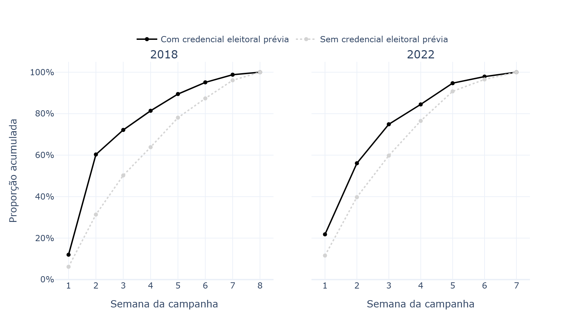
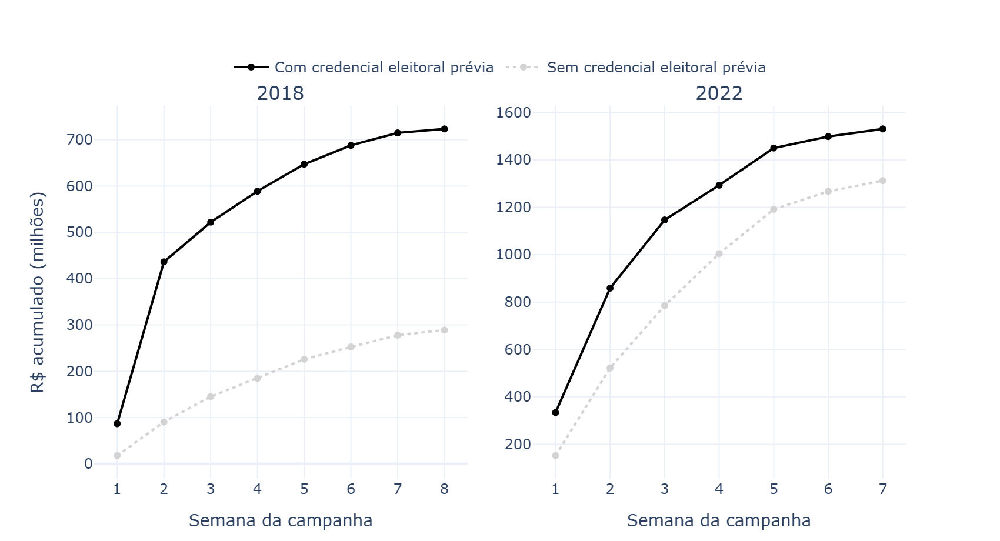
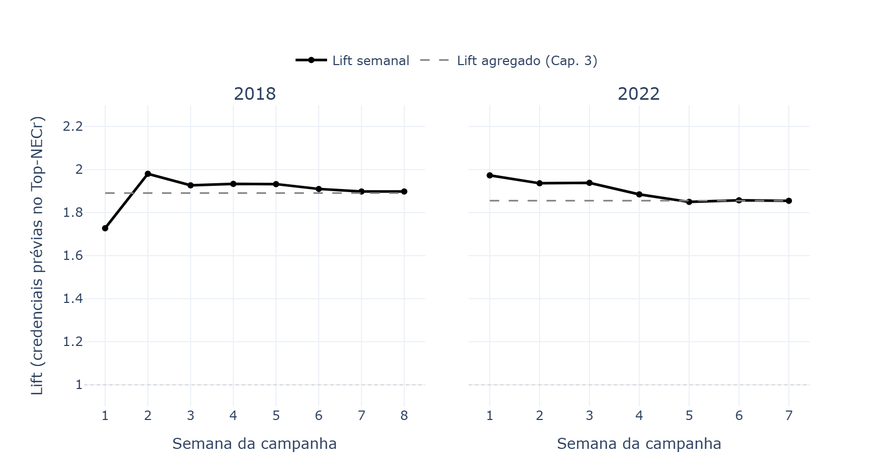
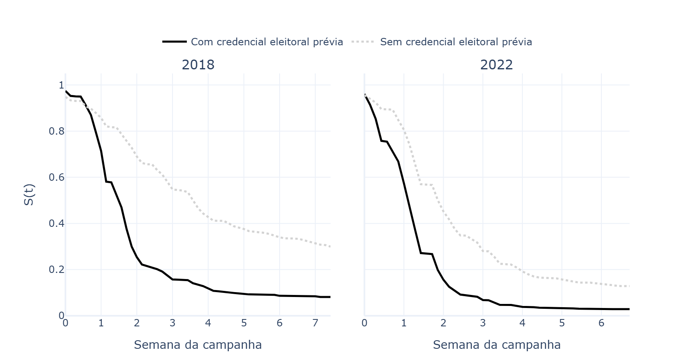
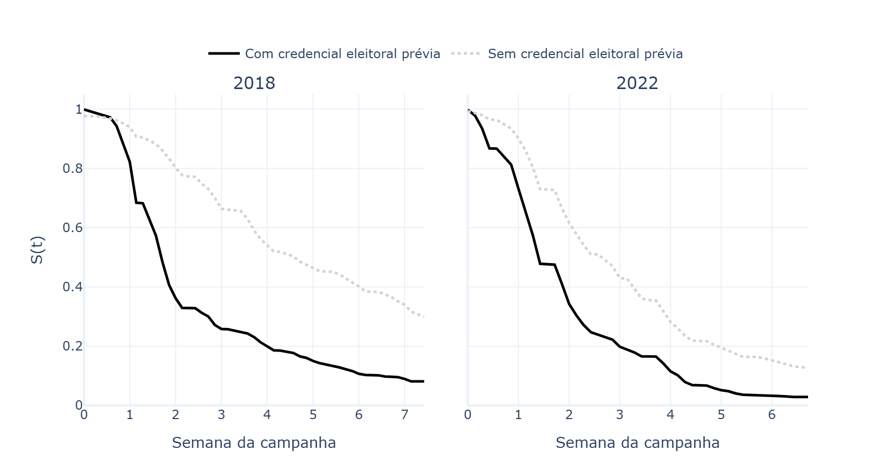

# A priorização pelo *timing* da transferência {#sec-cap4}

Utilizando o calendário eleitoral de 2022 como exemplo, em 16 de junho daquele ano o TSE divulgou os valores do FEFC que foram distribuídos aos partidos. Os partidos tiveram até o dia 5 de agosto para realizar suas convenções e divulgar as nominatas das candidaturas aprovadas pelas direções. A campanha eleitoral teve início em 16 de agosto, com a permissão de veiculação de propaganda eleitoral em todos os meios de comunicação. As eleições em si ocorreram em 2 de outubro.

Entre a divulgação dos valores do FEFC e a data final para realização das convenções há 50 dias de diferença. É neste contexto que as cúpulas partidárias avaliam candidaturas e formam suas listas. Já entre as convenções e o início do período eleitoral com a permissão de propaganda são mais 11 dias de diferença. Ou seja, entre os partidos saberem os valores que teriam à disposição e o início das campanhas são 61 dias no total, período em que a estratégia eleitoral está sendo desenhada.

O recebimento de receitas de campanha pelas candidaturas depende de (i) requerimento do registro da candidatura, (ii) CNPJ específico da campanha e (ii) abertura de conta corrente específica. Dado este cenário, as transferências monetárias realizadas aos candidatos ocorrem de fato durante o próprio período de campanha. Dito de outra maneira, é no período eleitoral que se torna visível a estratégia adotada pelos partidos para coordenar suas nominatas em termos de aplicação de recursos de fundos públicos.

Este capítulo analisa o *timing* da distribuição de recursos por partidos políticos a suas candidaturas a Deputado Federal em 2018 e 2022, e representa o teste da expectativa (iii) definida em @sec-argumento. As eleições estudadas compartilham o regime de financiamento público centralizado via FEFC, mas diferem em aspectos institucionais relevantes.

Em 2018, partidos ainda podiam se coligar em eleições proporcionais, e a campanha eleitoral durou 52 dias. Em 2022, as coligações foram proibidas nas eleições proporcionais, a campanha durou 47 dias, e a cláusula de barreira seguia sendo implementada gradualmente com patamares crescentes. Estes fatores criaram incentivos adicionais para que os partidos alocassem recursos de forma mais desconcentrada, já que não contavam com uma coligação para garantir o quociente partidário, cada legenda precisou construir seu desempenho eleitoral de forma autônoma.

Sob o FEFC, partidos ganham capacidade de agência significativa. Ao saber de antemão o montante reservado para a legenda, lideranças partidárias podem desenhar a estratégia de distribuição dos recursos antes mesmo da campanha começar. O recebimento antecipado de recursos de campanha dá aos candidatos contemplados maior margem para aplicação deste dinheiro, podendo garantir melhores profissionais, materiais e fornecedores. Além de contribuir para "colocar a campanha na rua" mais cedo e por mais tempo.

## A campanha eleitoral semana a semana

{#fig-semana-campanha fig-align="center" width="100%"}

A @fig-semana-campanha apresenta a proporção acumulada dos recursos recebidos por candidaturas a Deputado Federal, distinguindo candidatos competitivos de não-competitivos (ex-ante). Em 2018, há um salto relevante na proporção acumulada entre a primeira e a segunda semana do período eleitoral para os dois grupos, mas o salto é bem mais acentuado para candidaturas competitivas: a proporção acumulada passa de 12,0% para 60,3% (48,3 p.p.) entre as semanas 1 e 2, ante 6,2% para 31,3% (25,2 p.p.) entre os concorrentes não-competitivos.

Em 2022, o padrão se repete, ainda que com uma diferença menor entre os grupos ao final da segunda semana: candidatos competitivos já acumulam 21,8% dos recursos na primeira semana (ante 11,6% dos não-competitivos) e chegam a 56,1% na segunda (34,3 p.p. de salto), contra 39,8% dos não-competitivos (28,2 p.p. de salto) — uma diferença ainda favorável aos competitivos, mas menor que a de 2018.

{#fig-semana-abs fig-align="center" width="100%"}

Em termos absolutos, a @fig-semana-abs confirma o padrão. Em 2018, candidatos competitivos tiveram um salto de R$349,6 milhões entre a primeira e a segunda semana de campanha (de R$86,7 milhões para R$436,3 milhões), contra um salto de R$72,8 milhões entre os não-competitivos (de R$17,8 milhões para R$90,6 milhões). O acréscimo entre os competitivos foi aproximadamente 4,8 vezes o observado entre os não-competitivos.

Em 2022, o salto absoluto para candidatos competitivos chega a R$525,2 milhões entre as duas primeiras semanas (de R$333,7 milhões para R$858,9 milhões), acima dos R$369,9 milhões acumulados pelos não-competitivos no mesmo intervalo (de R$152,0 milhões para R$521,9 milhões). O padrão de antecipação para candidaturas competitivas, portanto, se mantém nos dois ciclos eleitorais sob o FEFC.

<!-- As curvas de recursos acumulados mostram em que ritmo o dinheiro chega a cada grupo. A @fig-lift-semanal complementa essa comparação ao examinar quando as candidaturas com credenciais eleitorais prévias passam a estar sobrerrepresentadas no núcleo financiado de suas nominatas. Para isso, o Top-NECr é recalculado ao final de cada semana com base nos recursos acumulados até aquele momento. Tanto o tamanho quanto a composição do núcleo podem mudar durante a campanha.**

O *lift* semanal compara a soma das presenças de candidaturas com credenciais nesses núcleos à soma das presenças esperadas em uma seleção aleatória que preserve o tamanho de cada núcleo, o tamanho de cada lista e seu número de candidaturas com credenciais. Valores superiores a um indicam sobrerrepresentação desse perfil. Como as listas sem recursos acumulados ainda não têm núcleo financeiro, o indicador é condicionado às listas já financiadas em cada semana. A  linha tracejada indica o *lift* agregado do capítulo anterior. -->

{#fig-lift-semanal fig-align="center" width="100%"}

<!-- Em 2018, o *lift* passa de 1,73 na primeira semana para 1,98 na segunda. Nesse segundo momento, os núcleos reúnem 98% mais candidaturas com credenciais do que seria esperado sob a referência aleatória. Nas semanas seguintes, o indicador permanece próximo de 1,9 e encerra a campanha em 1,90. Em 2022, a sobrerrepresentação já alcança 1,97 na primeira semana, mantém-se próxima de 1,94 nas duas semanas seguintes e passa a oscilar em torno de 1,85 nas três últimas.

A sobrerrepresentação aparece, portanto, nas primeiras etapas observadas e persiste à medida que o financiamento se amplia. Entre a primeira e a segunda semana, a proporção do total de candidaturas com credenciais incluídas nos núcleos passa de 18,3% para 63,6% em 2018 e de 29,3% para 67,5% em 2022. O crescimento dessa cobertura, acompanhado por um *lift* próximo de dois na segunda semana, indica que a expansão dos núcleos mantém uma presença desproporcional de candidaturas com histórico eleitoral favorável. A associação identificada na distribuição agregada do capítulo anterior já é observável durante a formação dessa distribuição.

A persistência do *lift* não implica que os mesmos candidatos permaneçam no núcleo durante toda a campanha. Sua composição e o conjunto de listas financiadas variam entre semanas, e o indicador sintetiza os recursos acumulados até cada momento. Por isso, as pequenas oscilações da curva não demonstram, por si sós, mudanças na orientação dos partidos ou perda de prioridade de candidaturas específicas.

Em conjunto, os fluxos acumulados e o *lift* semanal são compatíveis com uma priorização financeira precoce de candidaturas com credenciais eleitorais. Esse padrão está em consonância com a expectativa de seletividade na distribuição dos recursos discutida a partir do "dilema do gatekeeper" de @fivaetal2024, embora os resultados não identifiquem a intenção que orientou cada transferência. A análise de sobrevivência apresentada a seguir examina diretamente a relação entre as credenciais e o tempo até o recebimento do primeiro e do maior repasse. -->

## A alocação partidária como um evento: análise de sobrevivência

### Kaplan-Meier: a chance de não recebimento por semana

<!-- ROTEIRO [4.2]. A definição dupla do evento (primeiro repasse / maior repasse) é uma boa checagem de robustez conceitual — mostra que o padrão não é sensível à escolha de qual repasse conta. Falta dizer por que este teste (Kaplan-Meier, descritivo) precede o Cox (com covariáveis) na exposição: a lógica usual (KM como preliminar não-paramétrico, Cox como o teste que controla por confundidores) só é explicitada na abertura da seção seguinte ("as curvas de Kaplan-Meier são evidências preliminares..."), e ficaria mais clara se antecipada aqui. -->

A análise de sobrevivência operacionaliza o "evento" de duas maneiras considerando a diferença em dias entre o início da campanha eleitoral e: i) o primeiro repasse recebido pelo candidato, e ii) o maior repasse recebido ao longo da campanha.

O teste Kaplan-Meier é um método descritivo não-paramétrico usado para calcular a probabilidade de que um indivíduo não tenha experimentado determinado evento até determinada data. Aqui será utilizado para mostrar a probabilidade de que candidaturas competitivas e menos competitivas não tenham recebido o primeiro ou o maior repasse ao longo das semanas de campanha de 2018 e 2022.

A @fig-km-cs mostra os resultados do teste considerando o primeiro repasse e a @fig-km-maior-cs o maior repasse. A alocação antecipada de recursos para candidaturas competitivas é o padrão observado nos dois ciclos eleitorais: ao final da primeira semana de campanha, a probabilidade de um candidato competitivo ainda não ter recebido o primeiro repasse é de 71,4% em 2018 e 57,4% em 2022, contra 85,8% e 80,6% entre os não-competitivos, respectivamente; ao final da segunda semana a diferença se acentua (25,4% vs. 69,0% em 2018; 15,6% vs. 45,2% em 2022). A especificação do evento altera a magnitude, mas não a direção do padrão — ao considerar o maior repasse em vez do primeiro, as diferenças entre competitivos e não-competitivos se mantêm, confirmando que a antecipação não é apenas do contato inicial, mas do investimento principal do partido.

{#fig-km-cs fig-align="center" width="100%"}

{#fig-km-maior-cs fig-align="center" width="100%"}

### Riscos proporcionais (Cox HR): determinantes do recebimento antecipado

<!-- Falta conectar com resultados do capítulo 3 -->

As curvas de Kaplan-Meier são evidências preliminares da antecipação da transferência de recursos controlados pelos partidos para candidaturas competitivas, porém os testes não dão conta de controlar por fatores que possam causar a diferença observada, como variáveis institucionais, por exemplo. Os modelos de riscos proporcionais de Cox [-@cox1972] permitem estimar o efeito de múltiplas variáveis como determinantes estruturais sobre a "taxa instantânea" da alocação dos recursos de campanha. É uma especificação semi-paramétrica, que estima a probabilidade condicional de um candidato receber a transferência do partido em um dado instante. Nestes modelos, calcula-se a *hazard ratio* (HR) que indica o quanto a "taxa instantânea" da ocorrência da alocação aumenta ou diminui para cada unidade adicional da variável. O HR superior a um indica recebimento antecipado.

Aplicando os testes para os dois ciclos eleitorais em separado, nota-se que para cada eleição anteriormente vencida para deputado federal, candidatos têm aumento de 54% na "taxa instantânea" de recebimento em 2018, caindo para 36% em 2022. Entre as variáveis de desempenho eleitoral, o efeito mais robusto é o da proporção de votos nominais dentro do distrito disputado na eleição anterior, indicando que além do histórico eleitoral de vitórias, o desempenho eleitoral imediatamente anterior para recandidaturas à Câmara dos Deputados é um determinante para recebimento antecipado de recursos partidários na campanha eleitoral. Um resultado consistente entre os dois ciclos é que não há efeito da magnitude do distrito sobre o tempo das transferências de recursos entre partidos a seus candidatos.

<!-- [4.3-1] "para cada eleição anteriormente vencida para deputado federal, candidatos têm aumento de 55%... caindo para 36% em 2022" ecoa exatamente o padrão do Cap. 3 (razão de parcela para deputado federal cai de 2,00 para 1,55 entre 2018 e 2022, mesma direção de queda). Vale uma nota cruzada: os dois resultados, obtidos por métodos diferentes (Cox aqui, logit fracionário condicional no Cap. 3), apontam para a mesma tendência de queda na vantagem entre os dois ciclos — isso é evidência de robustez do achado substantivo (a vantagem de credenciais diminuiu, mas não desapareceu) por dois desenhos independentes, e merece ser dito explicitamente, inclusive na Discussão deste capítulo. -->

```{python}
#| label: tbl-cox
#| tbl-cap: "Determinantes do *timing* do repasse partidário — Modelo Cox PH. HR: *hazard ratio*; IC 95\\%: intervalo de confiança de 95\\%. SE clusterizados por partido × UF. \\*p<0,05; \\*\\*p<0,01; \\*\\*\\*p<0,001."
import pandas as pd
from tabulate import tabulate
from IPython.display import Markdown

rotulos = {
    "n_eleicoes_deputado_federal":  "N. Eleições Dep. Federal",
    "n_eleicoes_deputado_estadual": "N. Eleições Dep. Estadual",
    "n_eleicoes_vereador":          "N. Eleições Vereador",
    "n_eleicoes_prefeito":          "N. Eleições Prefeito",
    "n_eleicoes_governador":        "N. Eleições Governador",
    "n_eleicoes_senador":           "N. Eleições Senador",
    "prop_votos_nominais_lag":      "Prop. votos nominais (t-1)",
    "log_qt_vaga":                  "Ln(magnitude)",
    "mulher":                       "Mulher",
    "negra":                        "Negra/Parda",
}

def sig(p):
    if p < 0.001: return "***"
    if p < 0.01:  return "**"
    if p < 0.05:  return "*"
    return ""

df = pd.read_parquet("../data/processed/df_cox_survival.parquet")
df = df[df["ano"].isin([2018, 2022])].copy()
df["label"] = df["variavel"].map(rotulos)

def formatar_ano(df, ano):
    d = df[df["ano"] == ano].copy()
    d["HR"] = d["exp(coef)"].map("{:.3f}".format) + d["p"].apply(sig)
    d["IC 95%"] = (
        "["
        + d["exp(coef) lower 95%"].map("{:.3f}".format)
        + "; "
        + d["exp(coef) upper 95%"].map("{:.3f}".format)
        + "]"
    )
    return d.set_index("label")[["HR", "IC 95%"]]

t18 = formatar_ano(df, 2018).rename(columns={"HR": "HR 2018", "IC 95%": "IC 95% 2018"})
t22 = formatar_ano(df, 2022).rename(columns={"HR": "HR 2022", "IC 95%": "IC 95% 2022"})

tbl = t18.join(t22).reset_index().rename(columns={"label": "Covariável"})

Markdown(tabulate(tbl, headers="keys", tablefmt="pipe", showindex=False))
```

## Discussão
